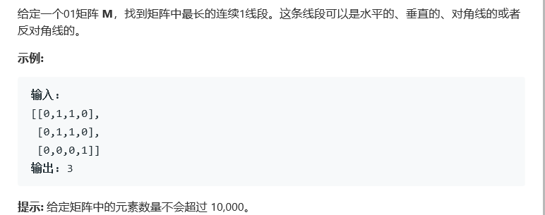

# 题目



# 算法

```python

```

```c++
class Solution {
    int overflow(vector<vector<int>>& M, int i, int j) {
        return i < 0 || j < 0 || i >= M.size() or j >= M[0].size();
    }
    int count(vector<vector<int>>& M, int i, int j, int direction_i, int direction_j) {
        int ans = 0, cur = 0;
        while (!overflow(M, i, j)) {
            if (M[i][j]) {
                ++cur;
                ans = max(ans, cur);
            } else {
                cur = 0;
            }
            i += direction_i;
            j += direction_j;
        }
        return ans;
    }
public:
    int longestLine(vector<vector<int>>& M) {
        if (M.size() == 0)
            return 0;
        int ans = 0;
        for (int i = 0; i != M.size(); ++i) {
            // 左边界为起点，向右
            ans = max(ans, count(M, i, 0, 0, 1));
            // 左边界为起点，向右下
            ans = max(ans, count(M, i, 0, 1, 1));
            // 右边界为起点，向左下
            ans = max(ans, count(M, i, M[0].size() - 1, 1, -1));
        }
        for (int j = 0; j != M[0].size(); ++j) {
            // 上边界为起点，向下
            ans = max(ans, count(M, 0, j, 1, 0));
            // 上边界为起点，向右下
            ans = max(ans, count(M, 0, j, 1, 1));
            // 上边界为起点，向左下
            ans = max(ans, count(M, 0, j, 1, -1));
        }
        return ans;
    }
};
```

以下动态规划方法

