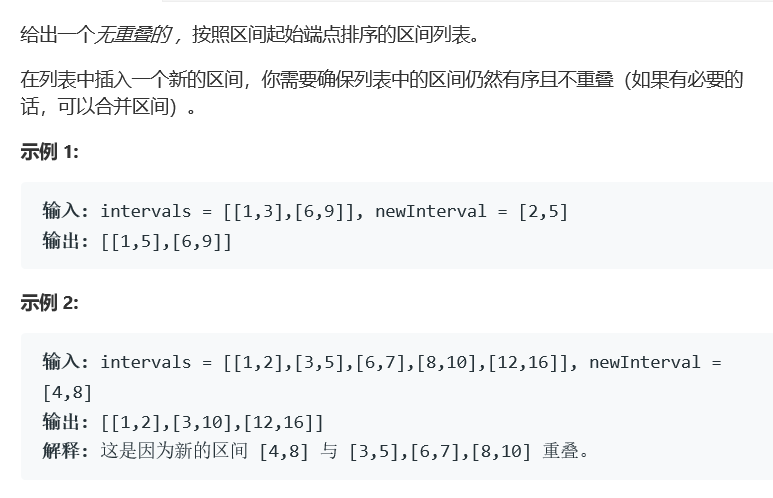

# 题目



# 算法

```
class Solution {
public:
vector<vector<int>> merge(vector<vector<int>>& intervals) {
        int size = intervals.size();
        if(size < 2) return intervals;
        auto cmp = [](vector<int> &a, vector<int> &b) {return a[0] < b[0];};
        sort(intervals.begin(), intervals.end(), cmp);
        int left = intervals[0][0], right = intervals[0][1],loc = 0, num = 1;
        vector<vector<int>> res;
        while(loc + num < size){
            if(right >= intervals[loc+num][0]){
                if(right < intervals[loc+num][1])
                    right = intervals[loc+num][1];
                    num++;
                //继续向右扩列
            }else{
                vector<int> tmp;
                tmp.push_back(left);
                tmp.push_back(right);
                res.push_back(tmp);
                loc = loc + num;
                num = 1;
                left = intervals[loc][0];
                right = intervals[loc][1];
            }
        }
        
        //handle the last
        if(right >= intervals[size-1][0]){
            if(right < intervals[size-1][1])right = intervals[size-1][1];
        }
        vector<int> tmp;
        tmp.push_back(left);
        tmp.push_back(right);
        res.push_back(tmp);
        return res;
    }
    vector<vector<int>> insert(vector<vector<int>>& intervals, vector<int>& newInterval) {
        intervals.push_back(newInterval);
        return merge(intervals);
    }
};
```

这个算法实际上完全可以使用56的算法来完成，问题在于，因为我们实际上需要融合的区间只在newInterval的左右两侧，单纯的使用56算法的话，我们会浪费很多时间，可以在public中维护一对左右值来减少时间浪费。