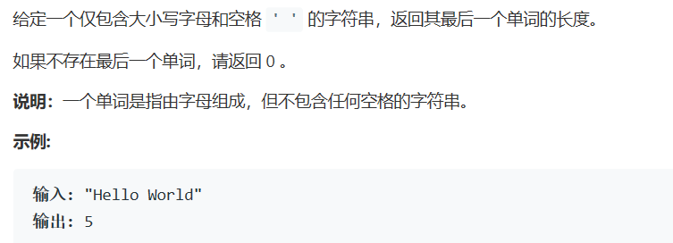

# 题目



# 算法

```
class Solution {
public:
    int lengthOfLastWord(string s) {
        int lastlen=0,first=0,index=0;
        for(int i=s.size()-1;i>=0;i--){
            if(s[i]!=' '){
                first=1;
                index=i;
                break;
            } 
        }
        if(first){
            for(int i=index;i>=0;i--){
                if(s[i]!=' ') lastlen++;
                else break;
            }
        }
        return lastlen;
    }
};
```

真的是简单问题，实际上在最后的统计阶段，我们可以用find，会更加快一点。

