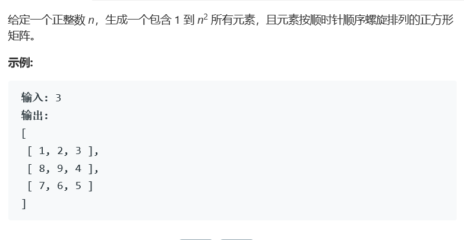
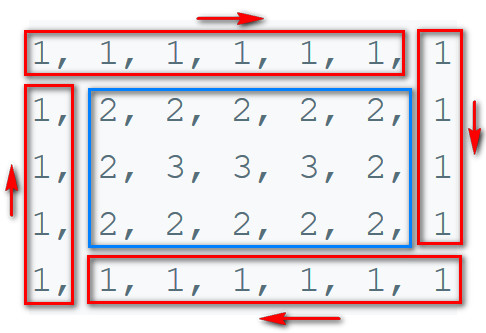

# 题目




# 题解

```
class Solution {
public:
    //结构上更优雅的代码
    vector<vector<int>> generateMatrix(int n) {
        vector<vector<int>> res(n, vector<int>(n));
        for(int s = 0, e = n - 1, m = 1; s<=e ; s++,e--){
            if(s==e) res[s][e] = m++;
            for (int j = s; j <= e-1; j++) res[s][j] = m++;
            for (int i = s; i <= e-1; i++) res[i][e] = m++;
            for (int j = e; j >= s+1; j--) res[e][j] = m++;
            for (int i = e; i >= s+1; i--) res[i][s] = m++;
        }
        return res;
    }
};
```

与螺旋矩阵一相同的剥洋葱方法来反向填充区域内容。



