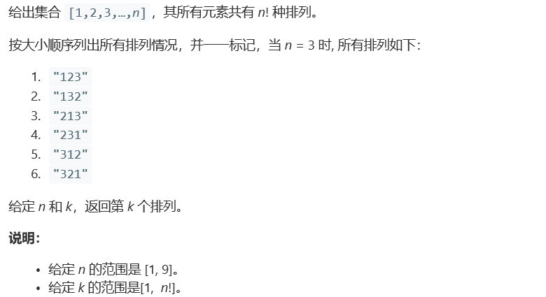

# 题目




# 算法

```
// 计算阶乘
int factorial (int n) {
    int res = 1;
    for (int i = 2; i <= n; i++) {
        res *= i;
    }
    return res;
}

class Solution {
private:
    list<char> ls;
    int this_k;
    int get_k (int n) {  // 获取需要第几个元素开头的排列，假设还剩n个数
        int tot = factorial(n-1);
        int res = 0;
        while(this_k > tot) {
            res++;
            this_k -= tot;
        }
        return (res + 1);
    }
    
    char get_list_k (int k) {  // 获取链表中第k个元素
        auto it = ls.begin();
        for (int i = 0; i < k - 1; i++) {
            it++;
        }
        char res = *it;
        ls.erase(it);
        return res;
    }

public:
    string getPermutation(int n, int k) {
        this_k = k;
        string res = "";
        for (int i = 1; i <= n; i++) {
            ls.push_back(48 + i);
        }
        for (int i = n; i >= 1; i--) {
            res += get_list_k(get_k(i));  // 在字符串末尾添加新位
        }
        return res;
    }
};
```

