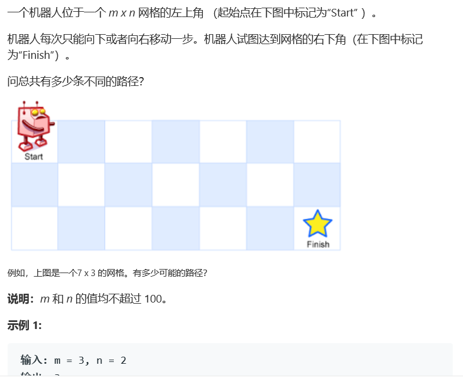
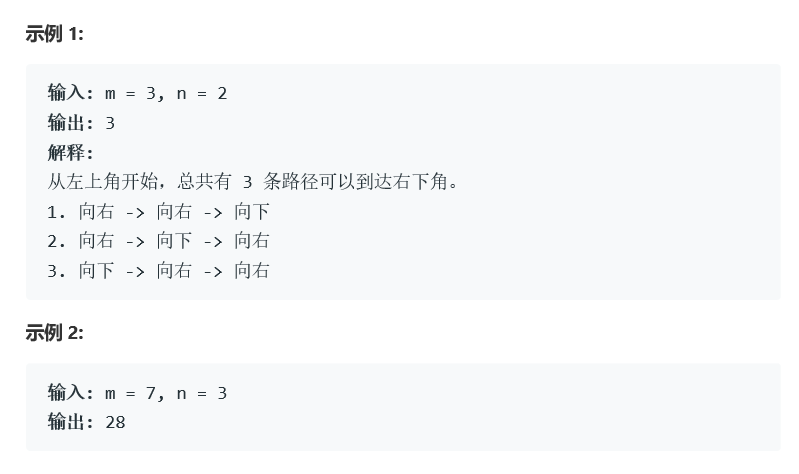

# 题目





# 算法

```c++

class Solution {
    struct pairInt{
        int x;
        int y;
        pairInt(int a,int b){ x = a; y = b;}
    };
public:
    int uniquePaths(int m, int n) {
      queue<pairInt*> q;
      pairInt* first = new pairInt(0,0);
      q.push(first);
      int num = 0;
      while(!q.empty()){
        pairInt *tmp = q.front();
        int x = tmp->x;
        int y = tmp->y;
        if( x == n-1 && y == m-1){
          num++;
        }else{
            if(x < n - 1){
                q.push(new pairInt(x+1,y));
            }
            if(y < m - 1){
                q.push(new pairInt(x,y+1));
            }
        }
        q.pop();
      }
      return num;
    }
};
```

bfs算法之间遍历所有可能结果，超出内存限制（大规模重用）

```c++
class Solution {
public:
    int* mul;
    int uniquePaths(int m, int n) {
        if(m*n <= 0)
            return 0;
        if(m == 1 || n == 1)
            return 1;
        mul = new int[m];
        for(int j = 0; j < m; j++){
            mul[j] = 1;
        }
        for(int i = 1; i < n; i++){
            for(int j = 0; j < m; j++){
                if(j == 0){
                    continue;
                }
                mul[j] = mul[j] + mul[j-1];
            }
        }
        return mul[m-1];
    }
};
```

dp算法，自顶向下

第一排为1，第一列为1，而后所有的格子为左方和上方的和（向右和向下可以抵达下一格）。

