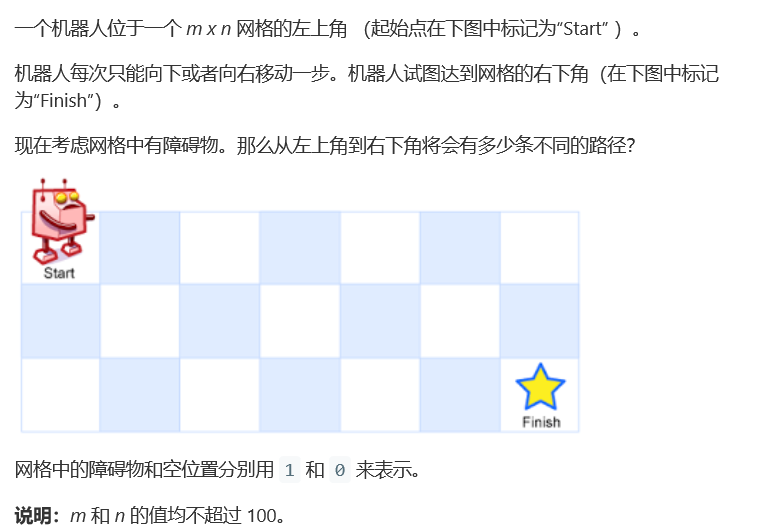
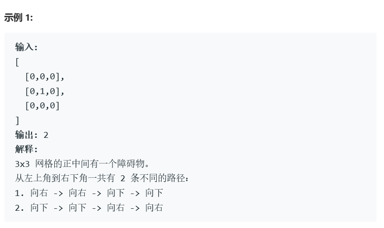

# 题目






# 算法

```
class Solution {
public:
    unsigned long long int* mul;
    int uniquePathsWithObstacles(vector<vector<int>>& obstacleGrid) {
        if(obstacleGrid.size() == 0)
            return 0;
        int m = obstacleGrid.size(), n = obstacleGrid[0].size();
        if(m*n <= 0)
            return 0;
        mul = new unsigned long long int[n];
        mul[0] = (obstacleGrid[0][0] == 0)?1:0;
        for(int j = 1; j < n; j++){
            if(mul[j-1] == 1 && obstacleGrid[0][j] == 0){
                mul[j] = 1;
            }                
            else {
                mul[j] = 0;
            }                
        }
        for(int i = 1; i < m; i++){
            for(int j = 0; j < n; j++){
                if(j == 0){
                    if(obstacleGrid[i][j] == 1)
                        mul[0] = 0;
                    continue;
                }
                if(obstacleGrid[i][j] == 0)
                    mul[j] += mul[j-1];
                else mul[j] = 0;

            }
        }
        return mul[n-1];
    }
};
```

算法实际上沿袭了62的dp解决思路。

区别在于，因为障碍物的原因，不能直接赋值，我们需要检测所有的点是否有障碍，才可以进行赋值。

包括初始的行列（重点），列0不能继续直接延续。

还有一点，这里会出现溢出的情况，不能直接使用int。