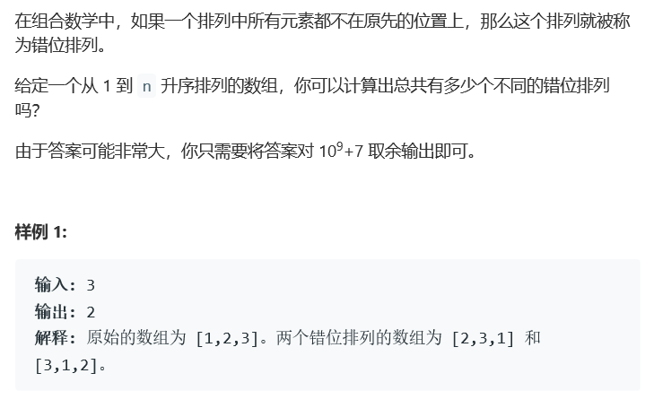
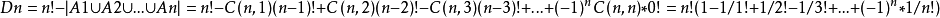

# 题目



# 算法

```python

```

```c++
class Solution {
public:
    int findDerangement(int n) {
        long long res = 1;
        int mod = 1000000007;
        if(n == 1){
            return 0;
        }else if(n == 2){
            return 1;
        }
        
        long long first = 0;
        long long second = 1;
        
        /*f[n] = (n-1)*(f[n-1] + f[n-2])*/
        for(int i = 3;i <= n; ++i){
            res = (i-1)*(first + second)%mod;
            first = second;
            second = res;
        }
        
        return res;
    }
};

//递推公式 f[n] = (n-1)*(f[n-1] + f[n-2])
```

还有另外一种公式法



```c++
class Solution {
public:
    int findDerangement(int n) {
        unsigned long long int m = 1,res = 0;
        int mark = 1;
        for(int i = 2; i <= n; i++){
            m *= i;
        }
        for(int i = 2; i < n; i++){
            m /= i;
            res += m*mark;
            mark = -mark;
        }
        return res%(100000007);
    }
};//但是我不知道这个算法有什么问题，它老是不对！
```

