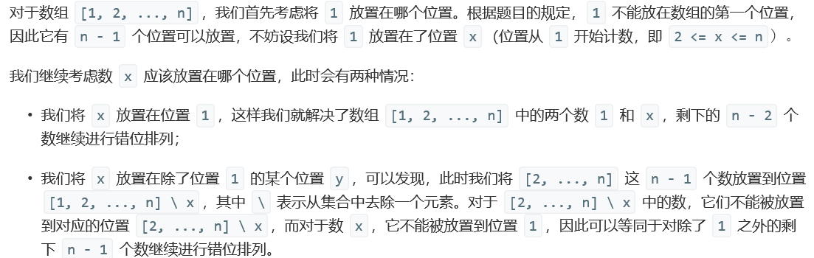
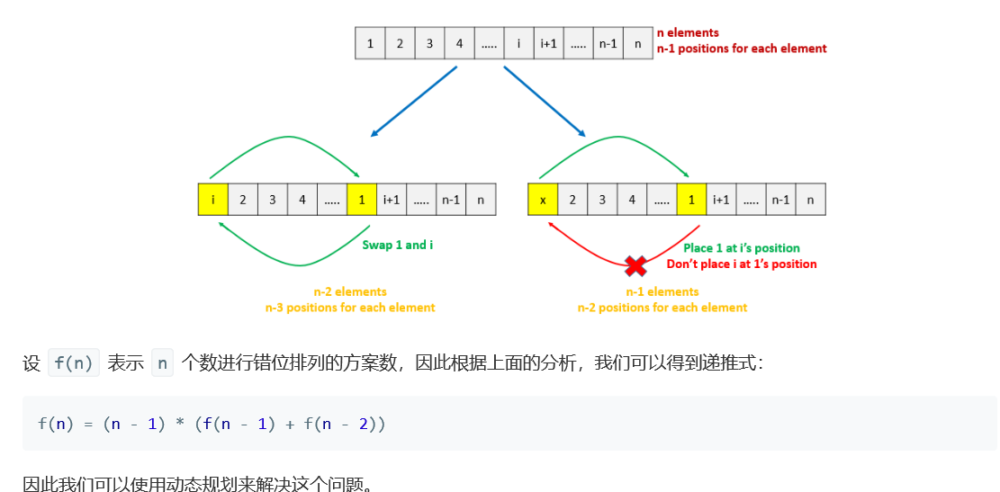

# 题目


# 算法

```python

```





```c++

class Solution {
public:
    int findDerangement(int n) {
        long long res = 1;
        int mod = 1000000007;
        if(n == 1){
            return 0;
        }else if(n == 2){
            return 1;
        }
        
        long long first = 0;
        long long second = 1;
        
        /*f[n] = (n-1)*(f[n-1] + f[n-2])*/
        for(int i = 3;i <= n; ++i){
            res = (i-1)*(first + second)%mod;
            first = second;
            second = res;
        }
        
        return res;
    }
};

//递推公式 f[n] = (n-1)*(f[n-1] + f[n-2])
```

还有另外一种公式法


```c++
class Solution {
public:
    int findDerangement1(int n) {
        unsigned long long int m = 1,res = 0;
        int mark = 1;
        for(int i = 2; i <= n; i++){
            m *= i;
        }
        for(int i = 2; i <= n; i++){
            m /= i;
            res += m*mark;
            mark = -mark;
        }
        return res%(1000000007);
    }
    int findDerangement2(int n) {
        unsigned long long int m = 1,i; long long int res = 0;
        bool mark = (n/2*2 == n)? true:false;
        for(i = 1; i < n ; i++){
            if(mark)
                res += m;
            else
                res -= m;
            cout<<"m"<<m<<"mark"<<mark<<"res"<<res<<endl;
            m *= n-i+1;
            mark = !mark;
        }
        //同样存在问题，因为res有正负，中间进行取模，加不过来，不取模就超了
        return res%(1000000007);
    }
};//但是我不知道这个算法有什么问题，它老是不对！
//它在地下几个数完全没问题啊，从21开始就出问题，怀疑过程中m越界


class Solution {
public:
    int findDerangement(int n) {
        long mul = 1, sum = 0, M = 1000000007;
        for(int i = n; i >= 0; i--){
            sum = (sum + M + mul * (i % 2 == 0 ? 1 : -1))%M;
            //对于M来说 (a+M) 模等于 a，这样就可以避免出现负数，也就是加不上的问题。
            mul = ( mul * i) % M;
        }
        return (int)sum;
    }
};//这个是可以的。
```


