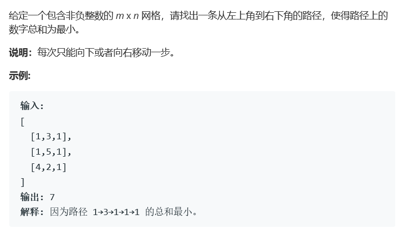
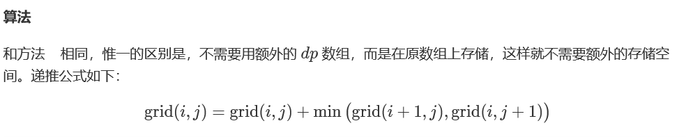

# 题目




# 算法

```
class Solution {
public:
    int* mul;
    int minPathSum(vector<vector<int>>& grid) {
        if(grid.size() == 0)
            return 0;
        int n = grid.size(), m = grid[0].size();
        if(m*n <= 0)
            return 0;
        mul = new int[m];
        mul[0] = grid[0][0];
        for(int j = 1; j < m; j++){
            mul[j] = grid[0][j] + mul[j-1];
        }
        for(int i = 1; i < n; i++){
            for(int j = 0; j < m; j++){
                if(j == 0){
                    mul[j] = mul[j] + grid[i][0];
                    continue;
                }
                if(mul[j] > mul[j-1])
                    mul[j] = mul[j-1];
                mul[j] += grid[i][j];
            }
        }
        return mul[m-1];
    }
};
```

实际上最小路径和问题和62、63两个问题有极大的相似之处，仍然可以使用简化的dp算法进行路径计算。




在数组地址上进行修改，有利于减少对应空间。