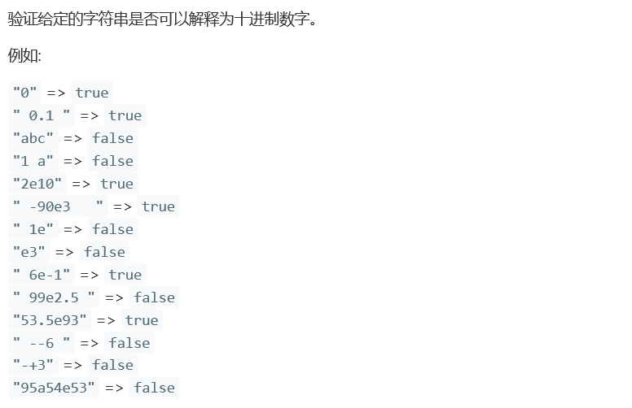
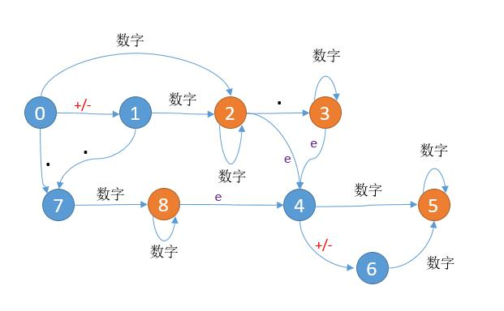

# 题目




# 算法

```java
public boolean isNumber(String s) {
    int state = 0; 
    s = s.trim();//去除头尾的空格
    //遍历所有字符，当做输入
    for (int i = 0; i < s.length(); i++) {
        switch (s.charAt(i)) {
             //输入正负号
            case '+':
            case '-':
                if (state == 0) {
                    state = 1;
                } else if (state == 4) {
                    state = 6;
                } else {
                    return false;
                }
                break;
            //输入数字
            case '0':
            case '1':
            case '2':
            case '3':
            case '4':
            case '5':
            case '6':
            case '7':
            case '8':
            case '9':
                //根据当前状态去跳转
                switch (state) {
                    case 0:
                    case 1:
                    case 2:
                        state = 2;
                        break;
                    case 3:
                        state = 3;
                        break;
                    case 4:
                    case 5:
                    case 6:
                        state = 5;
                        break;
                    case 7:
                        state = 8;
                        break;
                    case 8:
                        state = 8;
                        break;
                    default:
                        return false;
                }
                break;
            //小数点
            case '.':
                switch (state) {
                    case 0:
                    case 1:
                        state = 7;
                        break;
                    case 2:
                        state = 3;
                        break;
                    default:
                        return false;
                }
                break;
            //e
            case 'e':
                switch (state) {
                    case 2:
                    case 3:
                    case 8:
                        state = 4;
                        break;
                    default:
                        return false;
                }
                break;
            default:
                return false;

        }
    }
    //橙色部分的状态代表合法数字
    return state == 2 || state == 3 || state == 5 || state == 8;
}
```

算法思路

使用类似于编译原理的状态机模型进行运作。

\