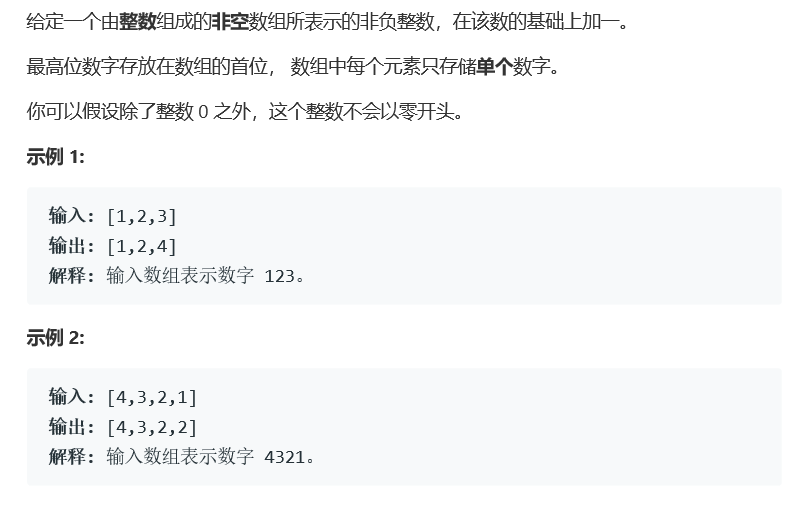

# 题目



# 算法

```c++
class Solution {
public:
    vector<int> plusOne(vector<int>& digits) {
        int size = digits.size();
        if(size > 0)
            for(int i = size-1; i >= 0; i--){
                if(digits[i] < 9){
                    digits[i]++;
                    break;
                }else{
                    digits[i] = 0;
                }
            }
        if(digits[0] == 0)
            digits.insert(digits.begin(), 1);
        return digits;
    }
};
```

简单的从后向前遍历的算法

注意点：

​	如果进位，需要前一位加1

​    如果越界，需要在开头添加一位1