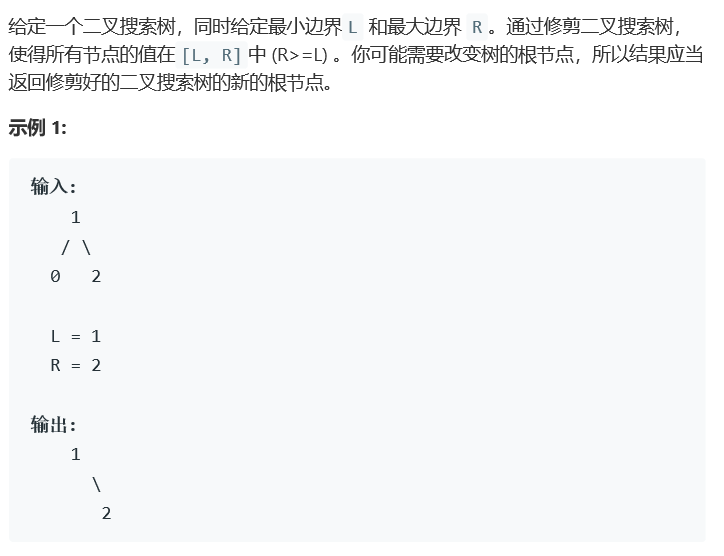
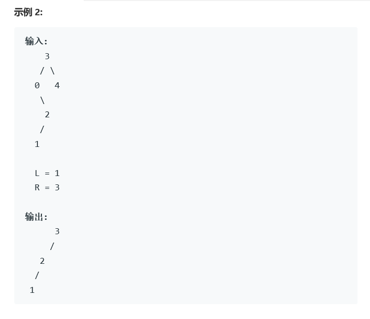

# 题目




# 算法

```python

```

```c++
/**
 * Definition for a binary tree node.
 * struct TreeNode {
 *     int val;
 *     TreeNode *left;
 *     TreeNode *right;
 *     TreeNode(int x) : val(x), left(NULL), right(NULL) {}
 * };
 */
class Solution {
public:
    TreeNode* trimBST(TreeNode* root, int L, int R) {
        if(root == nullptr) return root;
        int val = root->val;
        if(val < L)
            return trimBST(root->right,L,R);
        if(val > R)
            return trimBST(root->left,L,R);
        root->left = trimBST(root->left,L,R);
        root->right = trimBST(root->right,L,R);
        return root;
    }
};
```

