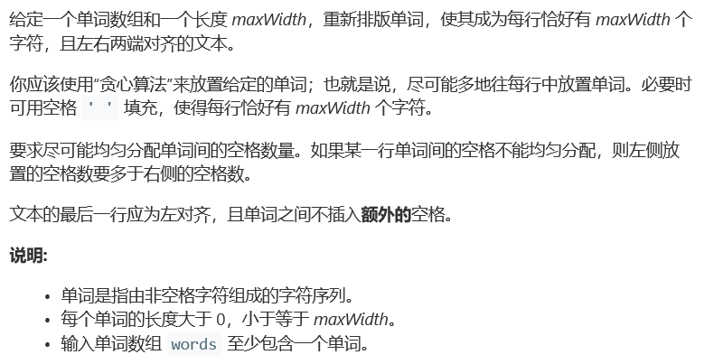
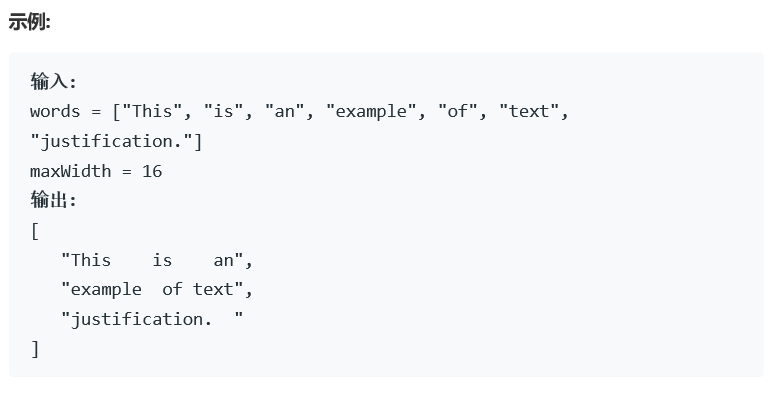
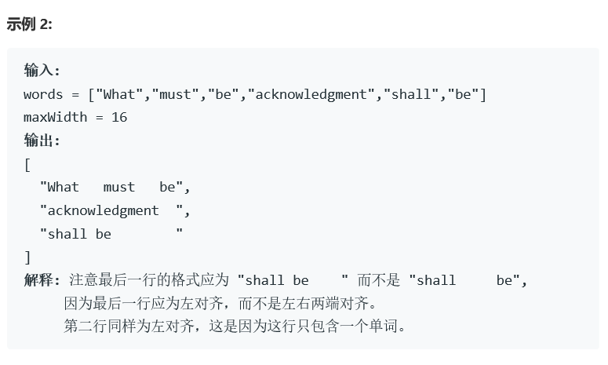
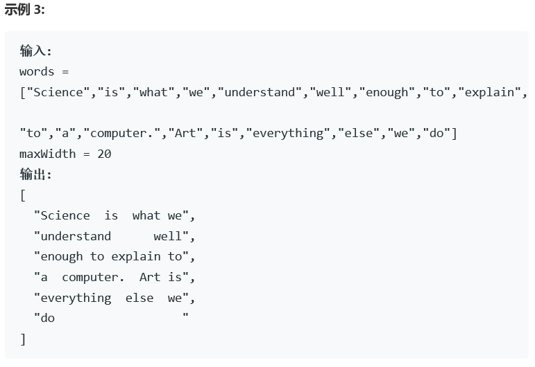

# 题目









# 算法

```
class Solution {
public:
	vector<string> fullJustify(vector<string>& words, int maxWidth) {
		vector<string> res;
		int n = words.size();
		for (int i = 0; i < n;)
		{
			int len = 0, num = -1;//len是单词的总长度，num是空格的最少个数，也就是单词个数-1
			while (len + num <= maxWidth && i < n)
			{
				len += words[i].length();
				++num;
				++i;
			}
			if (len + num > maxWidth)
			{
				--i;;
				--num;
				len -= words[i].length();
			}
			if (i != n)
			{
				i -= num + 1;
				int blank = maxWidth - len;
				if (num > 0)
				{
					vector<int> blanks = vector<int>(num, blank / num);
					for (int j = 0; j < blank%num; ++j)
					{
						blanks[j] += 1;
					}
					string s;
					int j;
					int m = blanks.size();
					for (j = 0; j < m; ++j)
					{
						s.append(words[i + j]);
						s.append(blanks[j], ' ');
					}
					for (; j < num + 1; ++j)
					{
						s.append(words[i + j]);
					}
					res.push_back(s);
				}
				else
				{
					string s = words[i];
					s.append(blank, ' ');
					res.push_back(s);
				}
			}
			else
			{
				i -= num + 1;
				string s;
				for (int j = 0; j < num; ++j)
				{
					s.append(words[i + j]);
					s.append(" ");
				}
				s.append(words[i + num]);
				s.append(maxWidth - len - num, ' ');
				res.push_back(s);
			}
			i += num + 1;
		}
		return res;
	}
};
```

