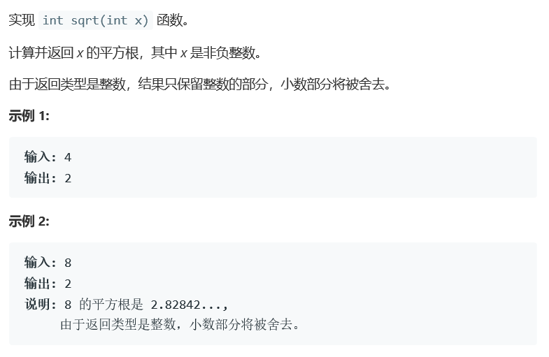

# 题目




# 算法 

```c++
class Solution {
public:
    int mySqrt(int x) {
        int num = x/2;
        if(x == 0 || x ==1 )
            return x;
        long left = 1;
        long right = x/2;
        while(left<right){
            long mid = (left + right)/2;
            if(mid*mid <= x && (mid+1)*(mid+1) > x)
                return (int)mid;
            else if(mid*mid < x)
                left = mid+1;
            else
                right = mid-1;
        }
        return (int)left;
    }
};
```

使用二分法寻找最合适的位置。

二分法的关键在于，left和right的判定，

while循环的终止条件也很重要。