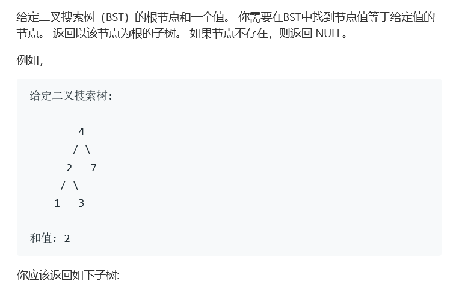
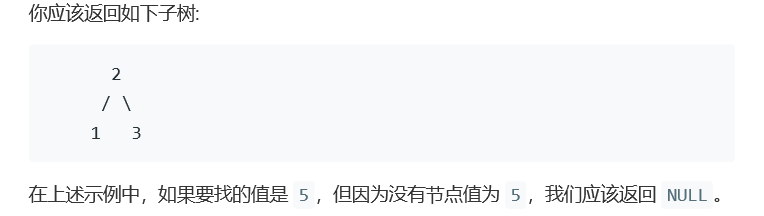

# 题目




# 算法

```python

```

```c++
/**
 * Definition for a binary tree node.
 * struct TreeNode {
 *     int val;
 *     TreeNode *left;
 *     TreeNode *right;
 *     TreeNode(int x) : val(x), left(NULL), right(NULL) {}
 * };
 */
class Solution {
public:
    TreeNode* searchBST(TreeNode* root, int val) {
        if(root == nullptr || root->val == val)
            return root;
        if(root->val > val)
            return searchBST(root->left,val);
        return searchBST(root->right,val);
    }
};
```

