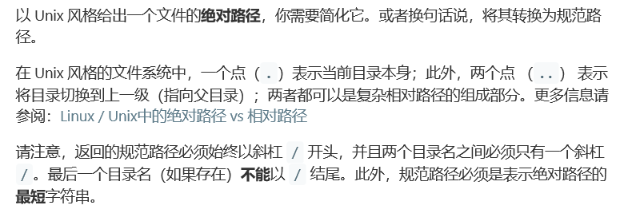
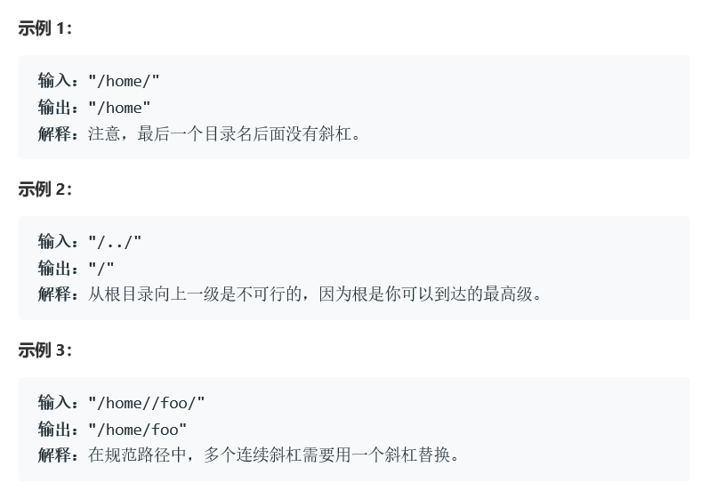
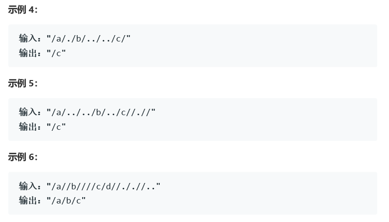

# 题目







# 算法

```c++
class Solution {
public:
    string simplifyPath(string path) {
        /*
         ‘./’ 删除
         ‘//’ 删除
         ‘../’ 返回上一级
          结尾的 ‘/’也要去掉
        */
        stringstream is(path);
        vector<string> strs;
        string res = "", tmp = "";
        while(getline(is, tmp, '/')) {// 以‘/’分割每个单位，同时stringstream并不会放入‘/’
            if(tmp == "" || tmp == ".")
                continue;
            else if(tmp == ".." && !strs.empty())
                strs.pop_back();
            else if(tmp != "..")
                strs.push_back(tmp);
        }
        for(string str:strs) //c++11
            res +=  "/" + str;
        if(res.empty())
            return "/";
        return res;
    }
};
```

使用stringstream分割单位。

使用vector完成层级，它相对于stack的不同只在于整合部分。