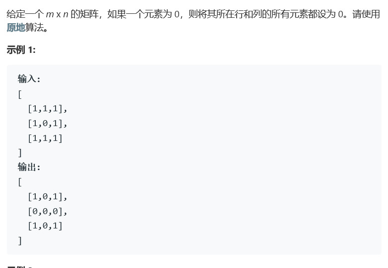
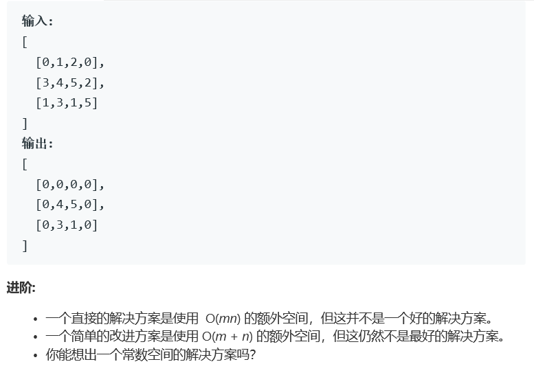

# 题目 





# 算法

```
class Solution {
public:
    void setZeroes(vector<vector<int>>& matrix) {
        if(matrix.size() == 0) return;
        int m = matrix.size(), n = matrix[0].size();
        bool *m0 = new bool[m], *n0 = new bool[n];
        for(int i = 0; i < m; i++)
            m0[i] = false;
        for(int i = 0; i < n; i++)
            n0[i] = false;
        for(int i = 0; i < m; i++){
            for(int j = 0; j < n; j++){
                if(matrix[i][j] == 0){
                    m0[i] = true;
                    n0[j] = true;
                }
            }
        }
        for(int i = 0; i < m; i++){
            for(int j = 0; j < n; j++)
                if(m0[i] || n0[j])
                    matrix[i][j] = 0;
        }
    }
};
```

标准算法，也平平无奇。时间复杂度O（MN），空间复杂度O（M+N）。

使用两个bool数组进行是否需要覆盖的判定。（使用set集合不需要赋初值，但是中间的操作时间可能会更长）


算法2！

使用标记的方式，在需要覆盖的每一行/列的开头标上特殊符号，然后，在结尾阶段进行覆盖。这种算法使用的空间复杂度为O（1），但是时间会稍微长一点点。