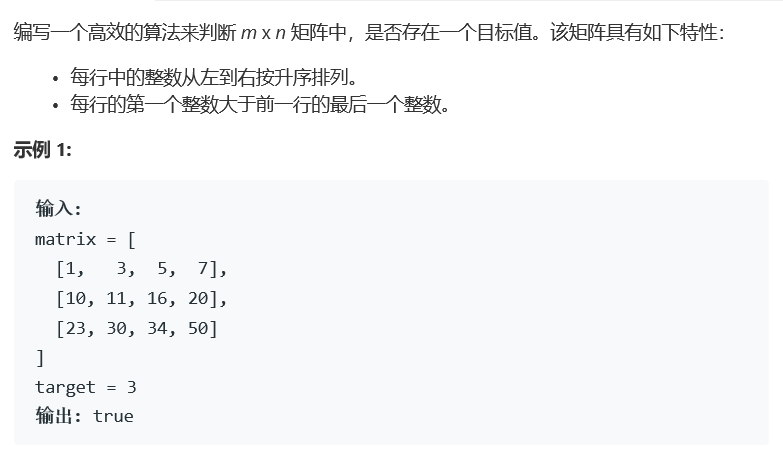
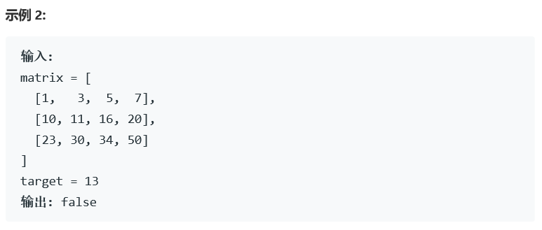

# 题目





# 算法

```
class Solution {
public:
    bool res;
    bool search(vector<int>& mark, int target){
        int left = 0,right = mark.size()-1;
        if(left == right)
            return mark[0] == target;
        while(left < right){
            if(right == left + 1)
                break;
            if(mark[left] == target || mark[right] == target)
                return true;
            int mid = (left + right)/2;
            if(mark[mid] == target)
                return true;
            else{
                if(mark[mid] > target)
                    right = mid;
                else left = mid;
            }
        }
        if(mark[left] == target || mark[right] == target)
            return true;
        return false;        
    }
    bool searchMatrix(vector<vector<int>>& matrix, int target) {
        res = false;
        if(matrix.size() < 1 || matrix[0].size() < 1)
            return false;
        int m = matrix.size(), n = matrix[0].size(),  i = 0;
        for(; i < m && m >1; i++){
            if(matrix[i][0] >= target){
                if(matrix[i][0] == target)
                    res = true;
                if(i != 0){
                    if(matrix[i-1][n-1] == target)
                        res = true;
                    else if(matrix[i-1][n-1] > target){
                        res = search(matrix[i-1],target);
                    }
                }
                break;
            }
        }
        i = m - 1;
        if(matrix[i][0] <= target && matrix[i][n-1] >= target){
            res = search(matrix[i],target);
        }
        return res;
    }
};
```

特殊情况搞死人

以下为官方方法

```
class Solution {
  public:
  bool searchMatrix(vector<vector<int>>& matrix, int target) {
    int m = matrix.size();
    if (m == 0) return false;
    int n = matrix[0].size();

    // 二分查找
    int left = 0, right = m * n - 1;
    int pivotIdx, pivotElement;
    while (left <= right) {
      pivotIdx = (left + right) / 2;
      pivotElement = matrix[pivotIdx / n][pivotIdx % n];
      if (target == pivotElement) return true;
      else {
        if (target < pivotElement) right = pivotIdx - 1;
        else left = pivotIdx + 1;
      }
    }
    return false;
  }
};

作者：LeetCode
链接：https://leetcode-cn.com/problems/search-a-2d-matrix/solution/sou-suo-er-wei-ju-zhen-by-leetcode/
来源：力扣（LeetCode）
著作权归作者所有。商业转载请联系作者获得授权，非商业转载请注明出处。
```

