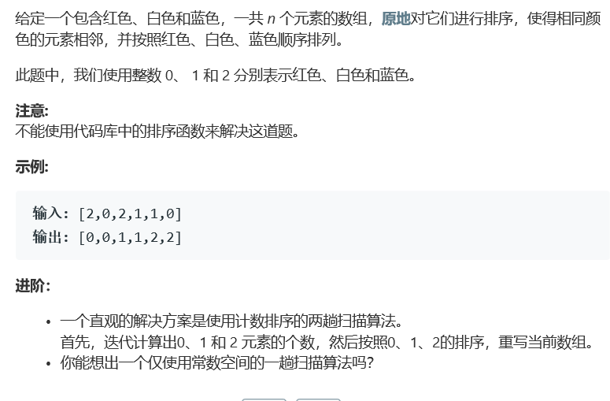

# 题目



# 算法

```
class Solution {
public:
    void sortColors(vector<int>& nums) {
        int a = 0, b = 0,  size = nums.size();
        if(size < 2 ) return;
        for(int i = 0; i < size; i++){
            switch(nums[i]){
                case 0: a++; break;
                case 1: b++; break;
                default: break;
            }
        }
        for(int i = 0; i < a; i++)
            nums[i] = 0;
        for(int i = a; i < a+b; i++)
            nums[i] = 1;
        for(int i = a+b; i < size; i++)
            nums[i] = 2;
    }
};
```

计算数量，直接赋值，不搞虚的