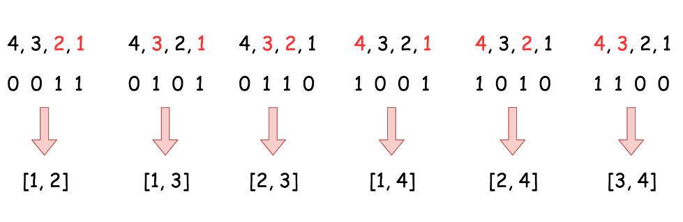

# 题目


# 算法


```python
class Solution:
    def combine(self, n: int, k: int) -> List[List[int]]:
        def backtrack(first = 1, curr = []):
            # if the combination is done
            if len(curr) == k:  
                output.append(curr[:])
            for i in range(first, n + 1):
                # add i into the current combination
                curr.append(i)
                # use next integers to complete the combination
                backtrack(i + 1, curr)
                # backtrack
                curr.pop()
        
        output = []
        backtrack()
        return output
		#回溯法函数回归不断地增加尾项知道填满
```


字典法

算法
算法非常直截了当 :

* 将 nums 初始化为从 1 到 k的整数序列。 将 n + 1添加为末尾元素，起到“哨兵”的作用。
  将指针设为列表的开头 j = 0.

* While j < k :
  * 将nums 中的前k个元素添加到输出中，换而言之，除了“哨兵”之外的全部元素。找到nums中的第一个满足 nums[j] + 1 != nums[j + 1]的元素，并将其加一nums[j]++ 以转到下一个组合。

```python
class Solution:
    def combine(self, n: int, k: int) -> List[List[int]]:
        # init first combination
        nums = list(range(1, k + 1)) + [n + 1]
        
        output, j = [], 0
        while j < k:
            # 他妈的这里能直接比大小？？？？
            # add current combination
            output.append(nums[:k])
            # increase first nums[j] by one
            # if nums[j] + 1 != nums[j + 1]
            j = 0
            while j < k and nums[j + 1] == nums[j] + 1:
                nums[j] = j + 1
                j += 1
            nums[j] += 1
            
        return output

```

