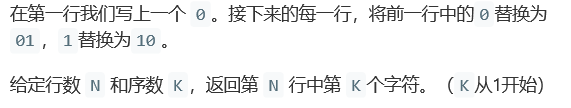
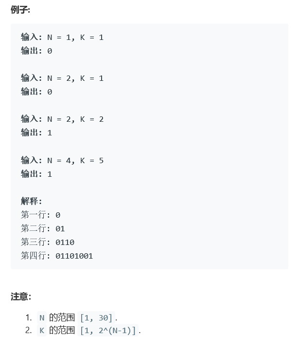

# 题目





# 算法

```python

```

```c++
class Solution {
public:
    int kthGrammar0(int N, int K) {
        //失败版本
        if(N == 1)
            return 0;
        long long int num = 1, res = 0, mark = 1;
        N--;
        while(N--){
            //N大于6以后，int就放不下了，还是要用string？
            long long int tmp = res;
            //cout<<tmp<<","<<num<<endl;
            res = tmp << num ;
            res |= (~tmp)&mark;//~tmp,很有可能多搞很多，必须约束一下
            mark = mark << num | mark;
            num *= 2;
        }
        return res >> (num-K) & 0b1;
    }
    int kthGrammar1(int N, int K){
        //超时
        if(N == 1)
            return 0;
        int num = 1;
        vector<bool> res(1,false);
        N--;
        while(N--){
            for(int i = 0; i < num; i++){
                res.push_back(!res[i]);
            }
            num *= 2;
        }
        if(K > num)
            return 0;
        else{
            return (res[K-1])?1:0;
        }
    }
    int kthGrammar(int N, int K){
        if(N == 1 || K == 1)
            return 0;
        vector<int> mark;
        int i = 0;
        while(i < N){
            mark.push_back(K);
            K=(K+1)/2;
            i++;
        }
        int num = mark.size();
        bool now = 0;
        num --;
        while(num ){
            if(mark[num-1] == 2*mark[num])
                now = !now; 
            num--;
        }
        return (now)?1:0;
    }
};
```


