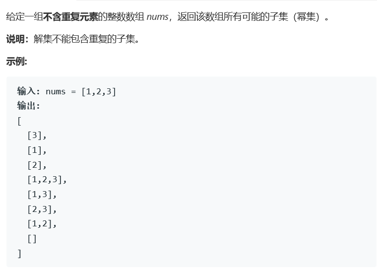

# 题目



# 算法

```python

```

```c++
class Solution {
public:
    vector<vector<int>> subsets(vector<int>& nums) {
        vector<vector<int>> res;
        vector<int> n;
        res.push_back(n);
        int size = nums.size();
        if(size == 0){
            return res;
        }
        if(size == 1){
            res.push_back(nums);
            return res;
        }
        int num = 1<<size, i = 0;
        i = 1;
        while(i < num){
            int j = 0;
            while(j < size){
                if(i>>j & 1)
                    n.push_back(nums[j]);
                    j++;
            }
            res.push_back(n);
            n.clear();
            i++;
        }
        return res;
    }
};
```

二进制判定法