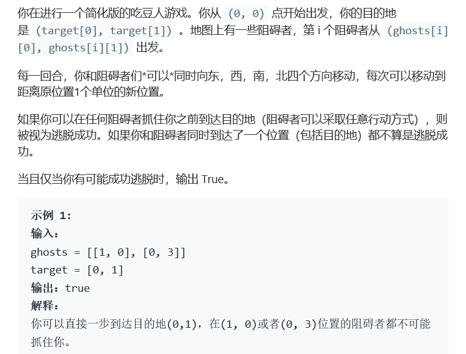
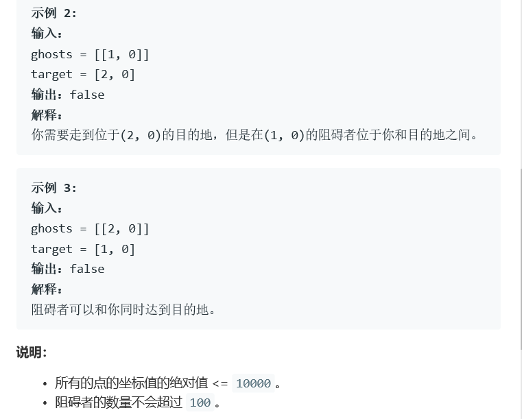

# 题目




# 算法

```python

```

```c++
class Solution {
public:
    bool escapeGhosts(vector<vector<int>>& ghosts, vector<int>& target) {
        if(ghosts.size() == 0)
            return true;
        int targetnum = abs(target[0]) + abs(target[1]), gsize = ghosts.size();
        for(int i = 0; i < gsize; i++){
            if(targetnum >= abs(ghosts[i][0] - target[0]) + abs(ghosts[i][1] - target[1]))
                return false;
        }
        return true;
    }
};
```

简单来说，就是我距离要比你短