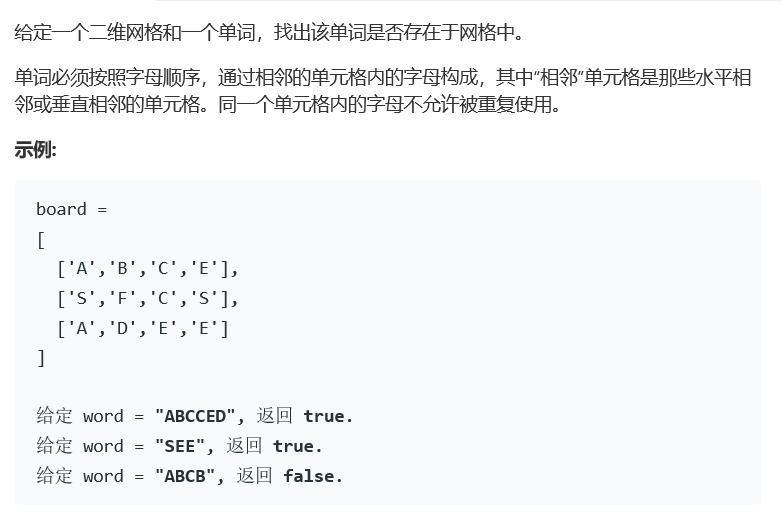

# 题目




# 算法

```python

```

```c++
class Solution {
public:
    vector<char> library;
    int row,column,ssize;
    vector<vector<bool>> mark;
    bool reexist(vector<vector<char>>& board, int i, int j, int loc){
        if(loc == ssize)
            return true;
        bool a = false, b = false, c = false, d = false;
        if(i > 0 && !mark[i-1][j])
            a = board[i-1][j] == library[loc];
        if(i < row-1 && !mark[i+1][j])
            b = board[i+1][j] == library[loc];
        if(j > 0 && !mark[i][j-1])
            c = board[i][j-1] == library[loc];
        if(j < column-1 && !mark[i][j+1])
            d = board[i][j+1] == library[loc];
        if(a || b || c || d){
            bool tmp = false;
            if(a){
                mark[i-1][j] = true;
                tmp = tmp || reexist(board,i-1,j,loc+1);
                mark[i-1][j] = false;
            }
            if(b && !tmp){
                mark[i+1][j] = true;
                tmp = tmp || reexist(board,i+1,j,loc+1);
                mark[i+1][j] = false;
            }
            if(c && !tmp){
                mark[i][j-1] = true;
                tmp = tmp || reexist(board,i,j-1,loc+1);
                mark[i][j-1] = false;
            }
            if(d && !tmp){
                mark[i][j+1] = true;
                tmp = tmp || reexist(board,i,j+1,loc+1);
                mark[i][j+1] = false;
            }
            return tmp;
        }
        else
            return false;
            
    }
    bool exist(vector<vector<char>>& board, string word) {
        row = board.size();
        if(word == "" || row == 0)
            return false;
        ssize = word.length();
        for(int i = 0; i < ssize; i++){
            library.push_back(word[i]);
        }
        column = board[0].size();
        vector<bool> m;
        for(int i = 0; i < column; i++)
            m.push_back(false);
        for(int i = 0; i < row; i++)
            mark.push_back(m);
        bool res = false;
        for(int i = 0; i < row && !res; i++){
            for(int j = 0; j < column && !res; j++){
                if(library[0] == board[i][j]){
                    mark[i][j] = true;
                    res = reexist(board,i,j,1);
                    mark[i][j] = false;
                }
            }
        }
        return res;
    }
};
```

二位表格，同时进行dfs遍历。

如果数据量比较小的话，可以使用int左移的方式来进行bool位判定，相对的省一些空间。

也可以使用特殊符号直接修改board，比如使用类似于   *‘-’*    的特殊文字来进行标记，这样的话可以省去mark部分的空间，但是相对的，要增加运算负担，增加一些在调用子函数后仍要使用的临时变量。