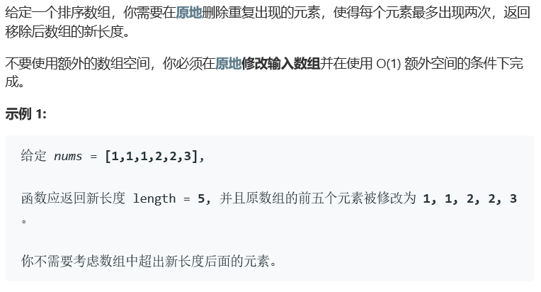
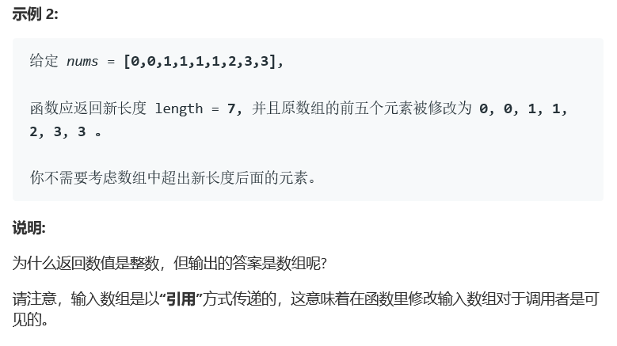
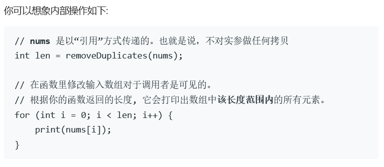

# 题目






# 算法

典型的双指针问题。

```python

```

```c++
class Solution {
public:
    int removeDuplicates(vector<int>& nums) {
        int num = 0, size = nums.size(), i = 0, j = 0, res = 0, pre;
        if(size <= 2) return size;
        pre = nums[0];
        while(j < size){
            if(nums[j] == pre){
                num ++;
                if(num < 3){
                    if(j >= i+num)
                        nums[i] = nums[j];
                    i++;
                    res++;
                }
            }else{
                pre = nums[j];
                num = 1;
                if(j >= i+num)//用来剪枝，减少赋值部分
                    nums[i] = nums[j];
                res++;
                i++;
            }
            j++;
        }
        return res;
    }
};
```

