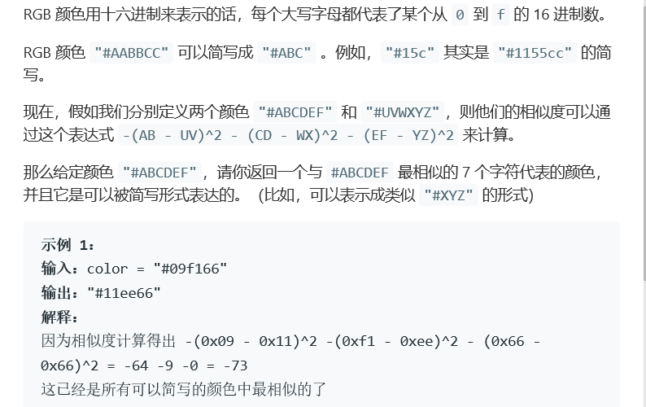
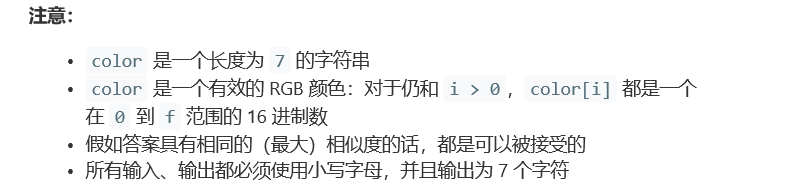

# 题目




# 算法

```python
class Solution(object):
    def similarRGB(self, color):
        """
        :type color: str
        :rtype: str
        """
        def f(comp):
            q, r = divmod(int(comp, 16), 17)
            if r > 8: q += 1
            return '{:02x}'.format(17 * q)

        return '#' + f(color[1:3]) + f(color[3:5]) + f(color[5:])
"""
拆分成三段来执行
还有一种更加暴力的，也就是16*16*16的做法
"""
```

```c++

```

