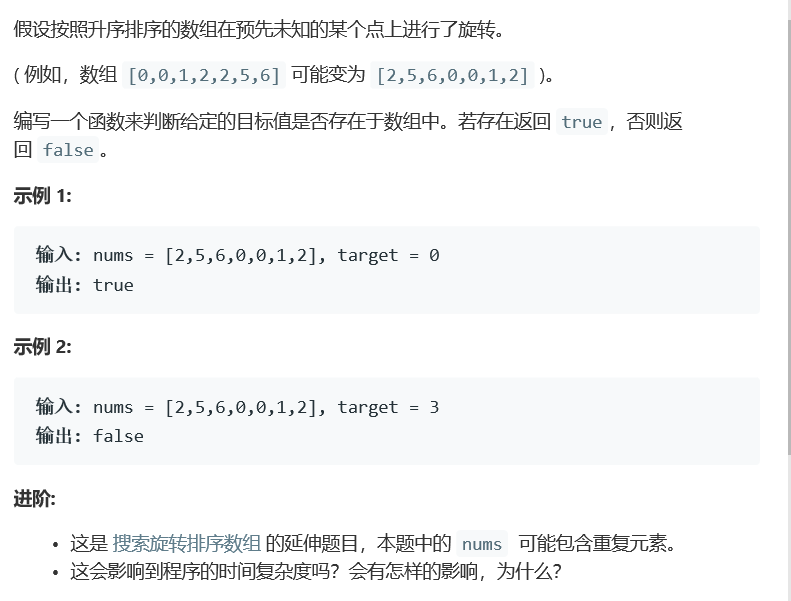

# 题目




# 算法

```python
class Solution(object):
    def search(self, nums, target):
        """
        :type nums: List[int]
        :type target: int
        :rtype: bool
        """
        #如果第一个数和最后一个数不相等，那么跟上一题没有区别
        #如果第一个数和最后一个数相等，而且等于target，return true
        #如果第一个数和最后一个数相等，但是不等于target，在最坏的情况下就需要遍历两个升序数组的某一个，已确定target有可能落在哪一段，极端情况时间复杂度会降低到0(N)
        if not nums:
            return False
        if nums[0] != nums[-1]:
            return self.search1(nums, target)
        if nums[0] == nums[-1]:
            if nums[0] == target:
                return True
            else:
                # for num in nums: #偷懒就可以这么写……直接上O(N)的算法
                #     if num == target:
                #         return True
                # return False
                return self.search2(nums, target)
        
    def search1(self, nums, target): #上一题的解答，两次二分查找分别找旋转点和结果
        """
        :type nums: List[int]
        :type target: int
        :rtype: int
        """
        if not nums:
            return -1
        if len(nums) == 1:
            return True if nums[0] == target else False
        
        lo, hi = 0, len(nums) - 1
        while(lo <= hi):
            mid = (lo + hi) // 2
            if mid + 1 < len(nums) and nums[mid] > nums[mid +1]: #旋转点为mid
                break
            if nums[mid] <= nums[-1]:
                hi = mid - 1
            elif nums[mid] >= nums[0]:
                lo = mid + 1
                
        if lo > hi:#没有旋转
            lo, hi = 0, len(nums) - 1
        else:
            if target >= nums[0]:
                lo, hi = 0, mid
            else:
                lo, hi = mid + 1, len(nums) - 1

        while(lo <= hi):
            mid = (lo + hi) // 2
            if nums[mid] == target:
                return True
            elif nums[mid] > target:
                hi = mid - 1
            else:
                lo = mid + 1
        
        return False
    
    def search2(self, nums, target):#这种情况下nums[0] == nums[-1]
        """
        :type nums: List[int]
        :type target: int
        :rtype: int
        """
        if not nums:
            return -1
        if len(nums) == 1:
            return True if nums[0] == target else False
        
        lo, hi = 0, len(nums) - 1
        while(lo <= hi):
            mid = (lo + hi) // 2
            if mid + 1 < len(nums) and nums[mid] > nums[mid +1]:
                break
            if nums[mid] == nums[0]: #无法确定mid落在哪一段
                i = mid
                while(i < len(nums) - 1 and nums[i] == nums[i + 1]):
                    i += 1
                if i == len(nums) - 1:#整个右段都找完了，全部跟nums[0]一样，所以target肯定落在左侧，也就是0 ~ mid这一段
                    hi = mid - 1
                else:
                    lo = mid + 1
                
            if nums[mid] < nums[-1]:
                hi = mid - 1
            elif nums[mid] > nums[0]:
                lo = mid + 1    
        print nums[mid]
        if target > nums[mid]:
            return False #因为mid一定是最大的那个数
        elif target == nums[mid]: #找到了就直接返回
            return True
        elif target < nums[mid]: #还需要二分查找，现在要确认找左侧还是找右侧
            if target > nums[0]: #在左侧找
                lo, hi = 0, mid - 1
            else: #在右侧找
                lo, hi = mid + 1, len(nums) - 1
            
        while(lo <= hi):
            mid = (lo + hi) // 2
            if nums[mid] == target:
                return True
            elif nums[mid] > target:
                hi = mid - 1
            else:
                lo = mid + 1
        
        return False
```

```c++
class Solution {
public:
    int findpivot(vector<int>&nums, int left, int right){
        if(nums[left] < nums[right]){
            return 0;
        }
        while (left <= right) {
            int pivot = (left + right) / 2;
            if (nums[pivot] > nums[pivot + 1])
                return pivot + 1;
            else {
                if (nums[pivot] < nums[left])
                right = pivot - 1;
                else
                left = pivot + 1;
            }
        }
        return 0;
    } 

    bool search(vector<int>& nums, int target) {
        int n = nums.size();
        if(n<1) return false;
        if(n<2) return (nums[0] == target)? true : false;
        if(n<3) return (nums[0] == target || nums[1] == target)? true:false;
        int i = 0, j = 1;
        cout<<n<<endl;
        while(j < n){
            cout<<j<<" "<<i<<"j i"<<endl;
            if(nums[j] != nums[i]){
                i++;
                nums[i] = nums[j];
            }
            j++;
        }
        cout<<i;
        int left = 0, right = i;
        cout<<i<<endl;
        int pivot = findpivot(nums,left,right);
        n = i+1;
        while(left<=right){
            int tmp = (left+right)/2;
            int t = (tmp + pivot) % n ;
            if(nums[t] == target){
                return true;
            }else{
                if(target < nums[t] ){
                    right = tmp - 1;
                }else{
                    left = tmp + 1;
                }
            }
        }
        return false;
    }
};
//去重然后算法33
```

本来，使用算法33应该是可以直接用的，但是我的算法33他的问题在于完全没有考虑相同的情况，使用检测会overflow

```c++
class Solution {
public:
    bool search(vector<int>& nums, int target) {
        unordered_set<int> dict(nums.begin(),nums.end());
        return dict.count(target);
    }
};

作者：joy-teng
链接：https://leetcode-cn.com/problems/search-in-rotated-sorted-array-ii/solution/ha-xi-ji-he-liang-xing-jie-jue-by-joy-teng/
来源：力扣（LeetCode）
著作权归作者所有。商业转载请联系作者获得授权，非商业转载请注明出处。
```

上方是简单方法，33和81都适用，但是空间就，呵呵了。