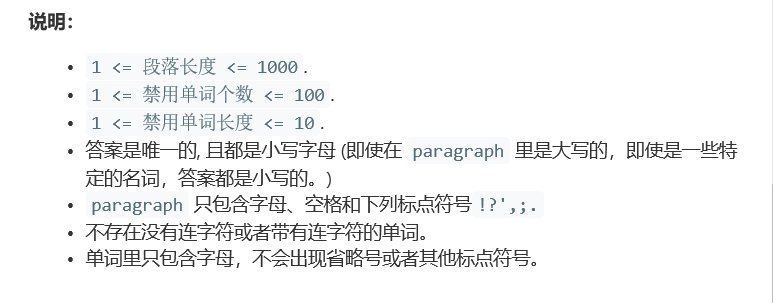

# 题目




# 算法

```python

```

```c++
class Solution {
public:
    static int cmp(pair<string,int>a,pair<string,int>b){
        return a.second>b.second;
        
    }
    string mostCommonWord(string paragraph, vector<string>& banned) {
        transform(paragraph.begin(), paragraph.end(), paragraph.begin(), ::tolower);
        int i = 0;
        while(i < paragraph.length()){
            if((paragraph[i] < 'a' || paragraph[i] > 'z')&& paragraph[i] != ' '){
                paragraph[i] = ' ';//一大堆稀奇古怪的异常
            }
            i++;
        }
        stringstream is(paragraph);
        string res, tmp;
        vector<pair<string,int>> storage;
        map<string,int> dictionary;
        while(getline(is,tmp,' ')){//没办法增加多个终止符，那么，就人为添加统一的终止符好了。
            if(tmp == "" ) continue;
            vector<string>::iterator it = find(banned.begin(), banned.end(), tmp);
            if (it != banned.end())
                continue;
            if(dictionary.count(tmp)){
                storage[dictionary[tmp]].second++;
            }else{
                storage.push_back(make_pair(tmp,1));
                dictionary[tmp] = storage.size()-1;
            }
        }
        sort(storage.begin(),storage.end(),cmp);
        return storage[0].first;
    }
};
```

