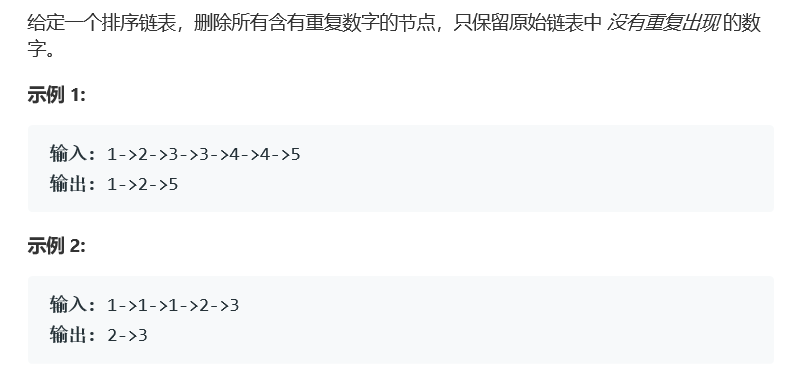

# 题目



# 算法

```python

```

```c++
/**
 * Definition for singly-linked list.
 * struct ListNode {
 *     int val;
 *     ListNode *next;
 *     ListNode(int x) : val(x), next(NULL) {}
 * };
 */
class Solution {
public:
    ListNode* deleteDuplicates(ListNode* head) {
        ListNode *dummy = new ListNode(-1),*slow = dummy,*fast = head;
        dummy->next = head;
        while(fast!=NULL&&fast->next!=NULL){ //快指针用于查找相同元素
            if(fast->val!=fast->next->val) {                  
                if(slow->next == fast) slow = fast; //快指针先前没查找到相同数
                else slow->next = fast->next; //先前查找到相同数，将出现相同数的前一个数连接到相同数后第一个不同数 
            }
            fast = fast->next;
        }
        if(slow->next != fast) slow->next = fast->next; // 针对类似[1,1]的情况
        return dummy->next;
    }
};
```

快慢指针