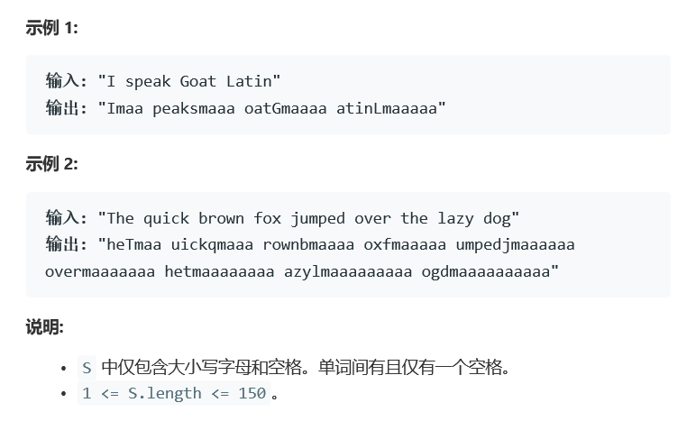

# 题目




# 算法

```python

```

```c++
class Solution {
public:
    string toGoatLatin(string S) {
        string res = "", tmp = "", tail = "a", component = "ma";
        set<char> vowel {'a','e','i','o','u','A','E','I','O','U'};
        stringstream sstream(S);
        bool turn = false;
        while(getline(sstream, tmp, ' ')){
            if(turn){
                res += " ";
            }else{
                turn = true;
            }
            if(!vowel.count(tmp[0])){
                char tmp1 = tmp[0];
                tmp.erase(0,1);
                tmp += tmp1;
            }
            tmp += component + tail;
            tail += "a";
            res += tmp;
        }
        return res;
    }
};
```

