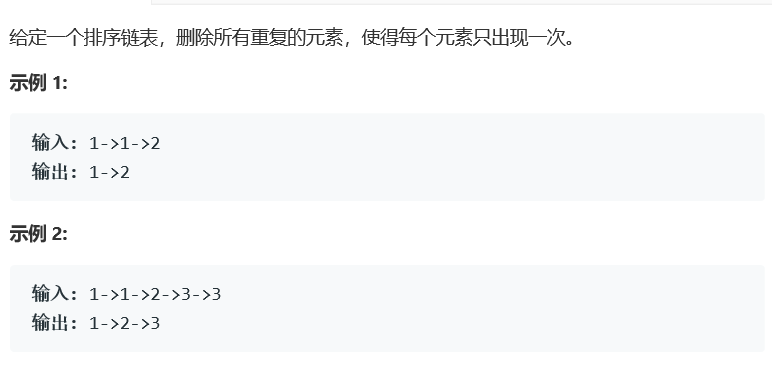

# 题目



# 算法

```python
# Definition for singly-linked list.
# class ListNode:
#     def __init__(self, x):
#         self.val = x
#         self.next = None

class Solution(object):
	def deleteDuplicates(self, head):
		"""
		:type head: ListNode
		:rtype: ListNode
		"""
		if not (head and head.next):
			return head
		i,j = head,head
		while j:
			# 如果i不等于j，则i前进一位，然后将j的值赋给i
			# 请配合动画演示理解
			if i.val!=j.val:
				i = i.next
				i.val = j.val
			# 不管i是否等于j，j每次都前进一位
			j = j.next
		i.next = None
		return head
```

