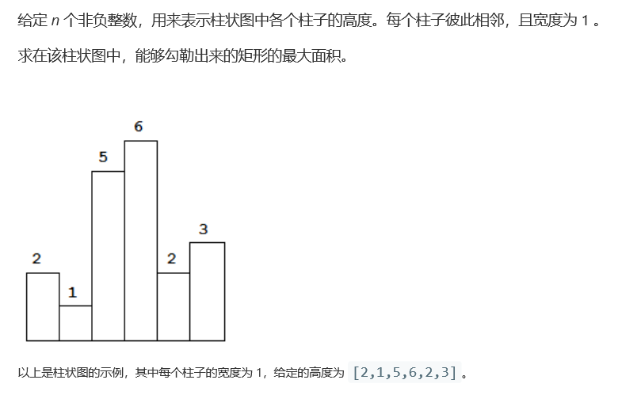
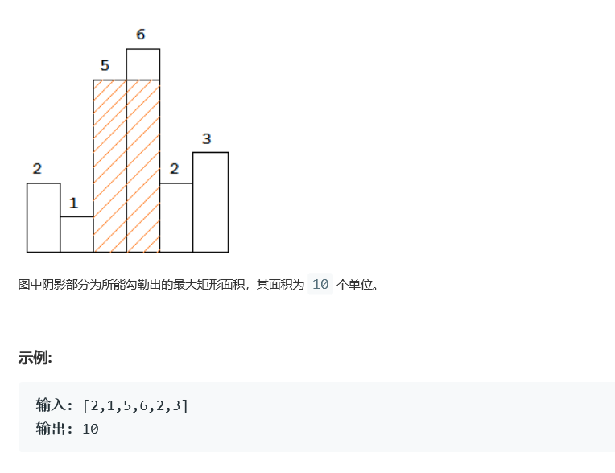

# 题目




# 算法

```c++
class Solution {
public:
    int largestRectangleArea(vector<int>& heights) {
        int min = 1, num = 0, res = 0, size = heights.size();
        bool mark = true;
        if(size == 0) return 0;
        if(size == 1) return heights[0];
        while(mark){
            mark = false;
            for(int i = 0; i < size; i++){
                if(heights[i] >= min){
                    num++;
                    mark = true;
                }else{
                    if( num * min > res){
                        res = num * min;                          
                    }
                    num = 0;
                }
            }
            if( num * min > res){
                res = num * min;                          
            }
            num = 0;
            min++;
        }
        return res;
    }
};
/*
	基本思维，自底向上，层层盘剥，问题在于时间复杂度位 O(size*max)
	未对特殊情况进行剪枝， 例如 [0,0,0,0,0,0,2147483647]
	在系统上过不去，下一步尝试进行使用 bool标志的方式来进行剪枝。同时，这就有一个额外的小情况需要考虑，也就是我们现有的体系，是通过隔离（高度达不到）来进行的，这里的判定需要改动一下
*/	
```

```c++
class Solution {
public:
    int max(int a, int b)
    {
        return a>b?a:b;
    }
    int largestRectangleArea(vector<int>& heights) {
        set<int> iset;
        int maxArea = 0;
        for (auto x: heights) iset.insert(x);
        for (auto x: iset)
        {
            int curArea = 0;
            for (auto y:heights)
            {
                if (y>=x) curArea+=x;
                else
                {
                    maxArea = max(maxArea, curArea);
                    curArea = 0;
                }
            }
            maxArea = max(maxArea, curArea);
        }
        return maxArea;
    }
};//某种巨慢的操作，但是他过了
/*
	他的优势在于减少了直接的等级增加，通过了set的方式减少了这个过程
*/
```

```c++
class Solution {
public:
    int calculateArea(vector<int>& heights, int start, int end){
        if(start>end)
            return 0;
        int minindex = start;
        for(int i = start; i <= end; i++)
            if(heights[minindex] > heights[i])
                minindex = i;
        int res = heights[minindex] * (end - start + 1);
        int res1 = calculateArea(heights, start, minindex-1);
        int res2 = calculateArea(heights, minindex+1,end);
        res1 = (res1 < res2)?res2:res1;
        return (res1 > res)? res1: res;
    }
    int largestRectangleArea(vector<int>& heights) {
        return calculateArea(heights,0,heights.size()-1);
    }
    //分治法处理问题，但是时间更慢了？？？？
    /*
    	时间复杂度：O(nlogn)
		空间复杂度：O(n)
    */
};
```


```c++
class Solution {
public:
    int largestRectangleArea(vector<int>& heights) {        
        stack<int> st;
        heights.push_back(0);
        int size = heights.size();
        int res = 0;
        for (int i = 0; i < size; ++i) {
            while (!st.empty() && heights[st.top()] >= heights[i]) {
                int val = st.top();
                st.pop();
                res = max(res, heights[val] * (st.empty() ? i : (i - st.top() - 1)));
            }
            st.push(i);
        }
        return res;
    }
};
//栈方法，最优解？
```

