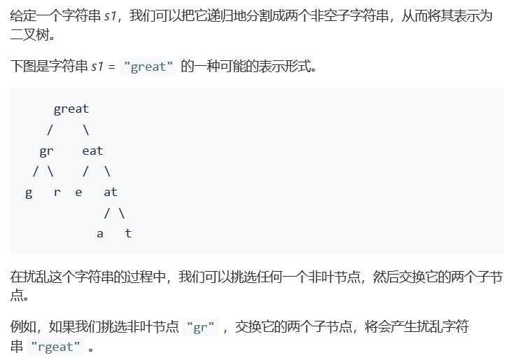
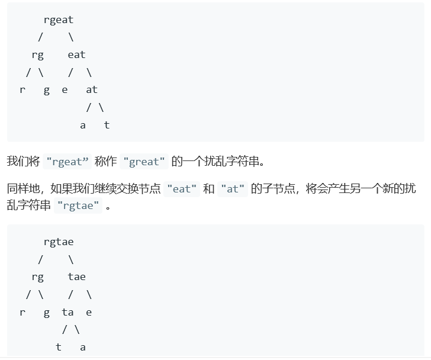
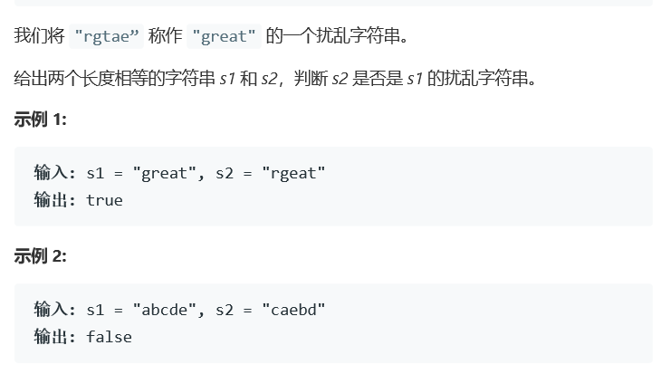

# 题目






# 算法

```C++
/* DP */
class Solution {
public:
    bool isScramble(string s1, string s2) {
        if (s1.size() != s2.size()) return false;
        if (s1.empty()) return true;
        int N = s1.size();
        vector<vector<vector<bool> > > dp(N + 1, vector<vector<bool> >(N, vector<bool>(N, false)));
        for (int i = 0; i < N; ++i) {
            for (int j = 0; j < N; ++j) {
                dp[1][i][j] = s1[i] == s2[j];
            }
        }
        for (int len = 2; len <= N; ++len) {
            for (int i = 0; i < N && i + len - 1 < N; ++i) {
                for (int j = 0; j < N && j + len - 1 < N; ++j) {
                    for (int k = 1; k < len; ++k) {
                        if (dp[k][i][j] && dp[len - k][i + k][j + k]) {
                            dp[len][i][j] = true;
                            break;
                        }
                        if (dp[k][i][j + len - k] && dp[len - k][i + k][j]) {
                            dp[len][i][j] = true;
                            break;
                        }
                    }
                }
            }
        }
        return dp[N][0][0];
    }
};
/*
	1，dp[len][i][j]代表s1与s2的两个长度为len的片段是否是为扰乱字符串对
其中，s1以i起始，s2以j起始，也就是s1[i:(i + len - 1)], s2[j:(j + len - 1)]这两段。
2，状态转移方程为：
dp[len][j][j] ||= (dp[k][i][j]&& dp[len - k][i + k][j + k]) || (dp[k][i][j + len - k] && dp[len - k][i + k][j])
其中k>=1 且 k < len
空间复杂度O(N^3)，时间复杂度O(N^4)
```

```c++
class Solution {
public:
    bool isScramble(const string& s1, const string& s2) {
        return isScramble(s1.begin(), s1.end(), s2.begin(), s2.end());
    }
    template<typename RandomIt>
    bool isScramble(RandomIt f1, RandomIt l1, RandomIt f2, RandomIt l2) {
        auto p = mismatch(f1, l1, f2, l2);
        if (p.first == l1 && p.second == l2) return true;
        string cp1(f1, l1); sort(cp1.begin(), cp1.end());
        string cp2(f2, l2); sort(cp2.begin(), cp2.end());
        if (cp1 != cp2) return false;
        for (int i = 1; i < distance(f1, l1); ++i) {
            auto m1 = next(f1, i);
            auto m2 = next(f2, i);
            auto n2 = prev(l2, i);
            if (isScramble(f1, m1, f2, m2) && isScramble(m1, l1, m2, l2))
                return true;
            if (isScramble(f1, m1, n2, l2) && isScramble(m1, l1, f2, n2))
                return true;
        }
        return false;
    }
};
```

如果s1可以被扰乱成s2，那么s1和s2排序后的字符串相同，并且2和3至少有一个成立。
s1的前半可被扰乱成s2的前半 且 s1的后半可被扰乱成s2的后半。
s1的前半可被扰乱成s2的后半 且 s1的后半可被扰乱成s2的前半。

