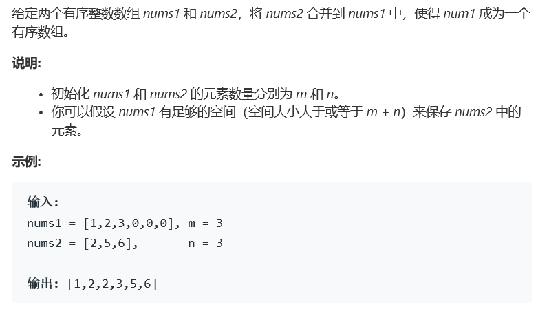

# 题目



# 算法

```python
class Solution:
    def merge(self, nums1: List[int], m: int, nums2: List[int], n: int) -> None:
        """
        Do not return anything, modify nums1 in-place instead.
        """
        nums1[:] = sorted(nums1[:m] + nums2)
    """
    合并然后排序，一行代码
    """
```

```c++
class Solution {
public:
    void merge(vector<int>& nums1, int m, vector<int>& nums2, int n) {
        for(int i = 0; i < n; i++)
            nums1[m+i] = nums2[i];
        sort(nums1.begin(), nums1.end()); 
    }
};
```

```python
class Solution(object):
    def merge(self, nums1, m, nums2, n):
        """
        :type nums1: List[int]
        :type m: int
        :type nums2: List[int]
        :type n: int
        :rtype: void Do not return anything, modify nums1 in-place instead.
        """
        # Make a copy of nums1.
        nums1_copy = nums1[:m] 
        nums1[:] = []

        # Two get pointers for nums1_copy and nums2.
        p1 = 0 
        p2 = 0
        
        # Compare elements from nums1_copy and nums2
        # and add the smallest one into nums1.
        while p1 < m and p2 < n: 
            if nums1_copy[p1] < nums2[p2]: 
                nums1.append(nums1_copy[p1])
                p1 += 1
            else:
                nums1.append(nums2[p2])
                p2 += 1

        # if there are still elements to add
        if p1 < m: 
            nums1[p1 + p2:] = nums1_copy[p1:]
        if p2 < n:
            nums1[p1 + p2:] = nums2[p2:]
   """
   双指针，比较合并，空间要大一点。
   """
```

```c++
class Solution {
public:
    void merge(vector<int>& nums1, int m, vector<int>& nums2, int n) {
        int p=0,i=0,j=0;
        vector<int> tmp(nums1.begin(),nums1.begin()+m);
        while(i<m&&j<n) nums1[p++] = (tmp[i] < nums2[j]) ? tmp[i++] : nums2[j++];
        while(j<n) nums1[p++] = nums2[j++];
        while(i<m) nums1[p++] = tmp[i++];
    }
};//神来之笔，如影随形
```

