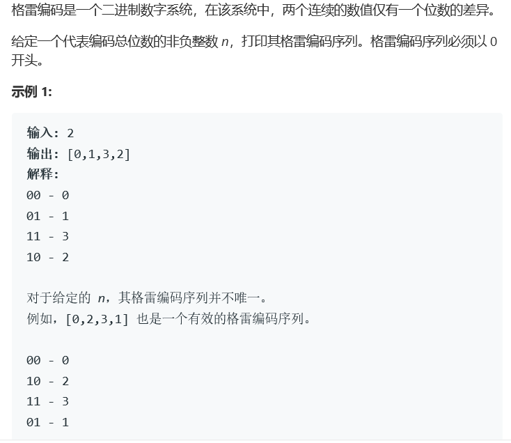
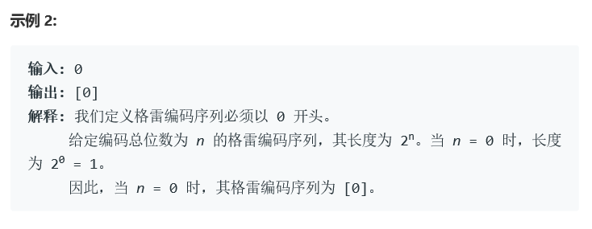

# 题目




# 算法

```python

```

```c++
class Solution {
public:
    void modify(int& tmp, int loc){
        bool mark = tmp>>loc & 1;//查看原本位置上是什么
        if(mark){
            //原本位置上是1，要改成0
            tmp = tmp & ~(1<<loc);
        }else{
            //原本位置上是0，要变成1
            tmp = tmp | (1<<loc);
        }
    }
    vector<int> grayCode(int n) {
        vector<int> res;
        /*
            不管时间和空间的情况下可以使用暴力的办法，使用set来避免重复，来进行遍历
            也就是把2^n个数都搞出来，直接放，从0开始
        */
        /*
            按照0
            010
            0102010
            010201030102010的递归规律改动可以采用队列的形式来做。但是空间还是很大啊？
            改进，因为队列实现重复比较困难，我们直接使用string来做。
            对于阶段n来说，需要执行n，执行string，然后进行string+n+string的操作就行。
            有个小问题，我们现在只能处理单位数，也就是说，我们需要一个中止符号，可以用‘/’
            同时使用stringstream来处理这个问题。
        */
        string mark = "";
        int loc = 0,tmp = 0;
        res.push_back(tmp);
        while(loc < n){
            //执行loc
            modify(tmp,loc);
            res.push_back(tmp);
            stringstream s(mark);
            int t;
            while(s>>t){
                //成功读取数字
                char blank_mark;
                modify(tmp,t);
                res.push_back(tmp);
                s>>blank_mark;
            }
            mark = mark+to_string(loc)+"/"+mark;
            cout<<mark<<endl;
            loc++;
        }
        return res;
    }
};
```

