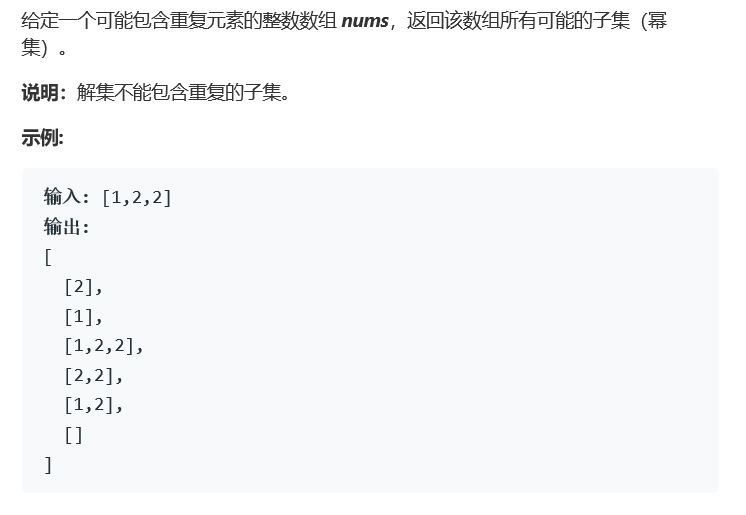

# 题目



# 算法

```python

```

```c++
class Solution {
public:
    vector<vector<int>> subsetsWithDup(vector<int>& nums) {
        vector<vector<int>> res;
        set<vector<int>> transit;
        vector<int> n;
        res.push_back(n);
        int size = nums.size();
        if(size == 0){
            return res;
        }
        if(size == 1){
            res.push_back(nums);
            return res;
        }
        int num = 1<<size, i = 0;
        i = 1;
        transit.insert(n);
        while(i < num){
            int j = 0;
            while(j < size){
                if(i>>j & 1)
                    n.push_back(nums[j]);
                    j++;
            }
            sort(n.begin(),n.end());
            if(!transit.count(n)){
                transit.insert(n);
                res.push_back(n);
            }
            n.clear();
            i++;
        }
        return res;
    }
};
```

在78的基础上增加了字段落的排序和使用set查重。时间用的不多，但是空间相对会大一些