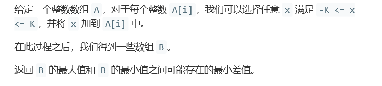

# 题目




# 算法

```python

```

```c++
class Solution {
public:
    int smallestRangeI0(vector<int>& A, int K) {
        int size = A.size();
        if(size < 2)
            return 0;
        sort(A.begin(),A.end());
        if(A[0] + K >= A[size - 1] - K)
            return 0;
        else
            return A[size-1] - K - A[0] - K ;
    }//版本1，问题在于sort所占用的时空太大！
    int smallestRangeI1(vector<int>& A, int K) {
        int size = A.size(),max = INT_MIN,min = INT_MAX;
        if(size < 2)
            return 0;
        for(int i = 0; i < size; i++){
            max = (max < A[i])? A[i]:max;
            min = (min < A[i])? min:A[i];
        }
        if(min + K >= max - K)
            return 0;
        else
            return max - min - 2*K ;
    }//时空均有显著提升
};
```

