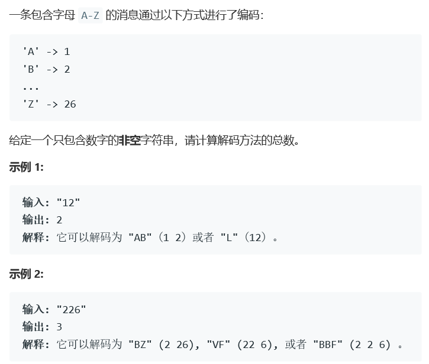

# 题目




# 算法


```c++
class Solution {
public:
    int numDecodings(string s) {
        // 特殊情况处理
        if(s.length() == 0) return 0;
        if(s[0] == '0') return 0;
        if(s.length() == 1) return 1;
        // 将 f[n] 压缩至 f[3] (仅保存 f[n - 2], f[n - 1], f[n])
        int f[3];
        f[2] = 1;
        f[1] = 1;
        int size = s.length();
        for(int i = 1; i < size; i ++)
        {
            // 位移
            f[0] = f[1];
            f[1] = f[2];
            // 方法判断累加
            if(s[i] == '0') f[2] = 0;//尾数本身不能算一个
            int tmp = (s[i - 1] - '0') * 10 + s[i] - '0';//计算两位数
            if(tmp > 9 && tmp < 27) f[2] += f[0];//保证前一位不是0
            //这里实际上筛去了两个0的情况，但是为什么01不行呢
        }
        return f[2];
    }
};
```

