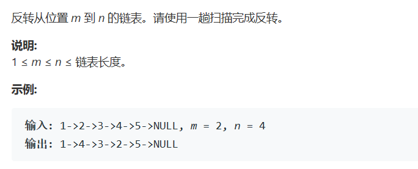

# 题目




# 算法

```python

```

```c++
/**
 * Definition for singly-linked list.
 * struct ListNode {
 *     int val;
 *     ListNode *next;
 *     ListNode(int x) : val(x), next(NULL) {}
 * };
 */
class Solution {
public:
    ListNode* reverseBetween(ListNode* head, int m, int n) {
        int loc=1;
        stack<ListNode*> transit;
        ListNode *cur = head, *pre = nullptr, *mpre , *nnext;
        while(loc<= n){
            if(loc == m){
                mpre = pre;
            }
            if(loc == n){
                nnext = cur->next;
            }
            if(loc >= m && loc <= n){
                transit.push(cur);
            }
            pre = cur;
            cur = cur->next; 
            loc++;       
        }
        if(mpre == nullptr){
            //从头开始换
            head = transit.top();
            transit.pop();
            cur = head;
        }else{
            cur = mpre;
        }
        while(!transit.empty()){
            pre = transit.top();
            cur->next = pre;
            cur = pre;
            transit.pop();
        }
        cur->next = nnext;
        return head;
    }
};
```

