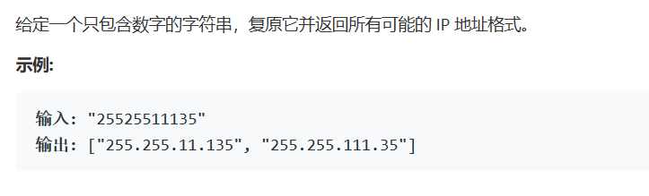

# 题目




# 算法

```python

```

```c++
class Solution {
public:
    bool legal(string s){
        if(s[0] != '0')
            return true;
        if(s.length() == 1)
            return true;
        return false;
    }
    vector<string> restoreIpAddresses(string s) {
        /*
            根据判定只有每个点只有三种情况，也就是在1，2，3这个位置的样子，同时对于特殊的长度还可以进行特殊判定，包括1-4，12，这种只有一种情况。也就是时间复杂度是常数级别
            同时因为空间也是确定的
        */
        int size = s.length(), loc = 0, cnt = 0;
        vector<string> res;
        string mark = ".";
        if(size<4) return res;
        while(cnt < 27){
            int a = cnt%3 + 1;
            int b = cnt/3%3 + 1 ;
            int c = cnt/9 + 1 ;
            int sum = a+b+c;
            if(sum < size && sum >= size-3){
                string s1 = s.substr(0,a);
                int n1,n2,n3,n4;
                n1 = atoi(s1.c_str());
                if(n1 < 256 && legal(s1)){
                    string s2 = s.substr(a,b);
                    n2 = atoi(s2.c_str());
                    if(n2 < 256  && legal(s2)){
                        string s3 = s.substr(a+b,c);
                        n3 = atoi(s3.c_str());
                        if(n3 < 256 && legal(s3)){
                            string s4 = s.substr(sum);
                            n4 = atoi(s4.c_str());
                            if(n4 < 256  && legal(s4)){
                                string t = s1+mark+s2+mark+s3+mark+s4; 
                                res.push_back(t);
                            }
                        }                        
                    }                    
                }                
            }
            cnt++;
        }
        return res;
    }
};
```

