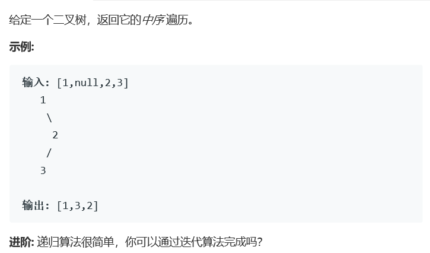

# 题目




# 算法

```python

```

```c++
/* 
# 中序遍历 先遍历左子树->根节点->右子树
# 如果是递归做法则递归遍历左子树，访问根节点，递归遍历右子树
# 非递归过程即:先访问..最左子树..结点，再访问其父节点，再访问其兄弟
# while循环条件 中序遍历需先判断当前结点是否存在，若存在则将该节点放入栈中，再将当前结点设置为结点的左孩子，
# 若不存在则取栈顶元素为cur，当且仅当栈空cur也为空，循环结束。
*/
/**
 * Definition for a binary tree node.
 * struct TreeNode {
 *     int val;
 *     TreeNode *left;
 *     TreeNode *right;
 *     TreeNode(int x) : val(x), left(NULL), right(NULL) {}
 * };
 */

class Solution {
public:
    vector<int> inorderTraversal(TreeNode* root) {
        vector<int> res,res1;
        if(root == nullptr)
            return res;
        res = inorderTraversal(root->left);
        res.push_back(root->val);
        res1 = inorderTraversal(root->right);
        res.insert(res.end(),res1.begin(),res1.end());
        return res;
    }
};//递归
class Solution1 {
public:    
    vector<int> inorderTraversal(TreeNode* root) {
        vector<int> ans;
        stack<TreeNode*> s;
        TreeNode* p=root;
        while(p || !s.empty()){
            if(p){
                s.push(p);
                p=p->left;
            }else{
                //回到父节点后，马上进入父结点的 右结点
                p = s.top();
                ans.push_back(p->val);
                s.pop();
                p=p->right;
            }
        }
        return ans;
    }
};//迭代

```

