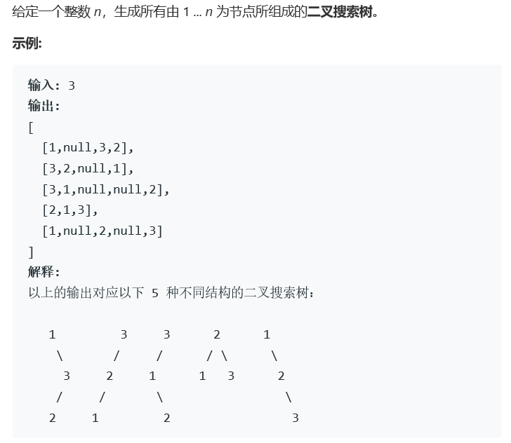

# 题目




# 算法

```python

```

```c++
/**
 * Definition for a binary tree node.
 * struct TreeNode {
 *     int val;
 *     TreeNode *left;
 *     TreeNode *right;
 *     TreeNode(int x) : val(x), left(NULL), right(NULL) {}
 * };
 */
class Solution1 {
public:
    vector<vector<int>> res1;
    int size1;
    void swap(vector<int>& nums, int first, int i){
        if(first == i) return;
        int tmp = nums[first];
        nums[first] = nums[i];
        nums[i] = tmp;
    }
    void backtrack( vector<int>& nums, int first ){
        if(first == size1){
            res1.push_back(nums);
        }
        for(int i = first; i < size1; i++){
            swap(nums,first,i);
            backtrack(nums,first+1);
            swap(nums,first,i);
        }
    }
    void permute(vector<int>& nums) {
        size1 = nums.size();
        if(size1 < 2)  {
            res1.push_back(nums);
            return ;
        }
        std::sort(nums.begin(),nums.end());
        backtrack(nums,0);
    }
    void generate(TreeNode* root, int loc, vector<int>& nums){
        if(loc == size1) return;
        TreeNode* cur = root;
        int num = nums[loc];
        while(true){
            if(num < cur->val){
                if(cur->left){
                    cur = cur->left;
                }else{
                    cur->left = new TreeNode(num);
                    break;
                }
            }else{
                if(cur->right){
                    cur = cur->right;
                }else{
                    cur->right = new TreeNode(num);
                    break;
                }
            }
        }
        generate(root,loc+1,nums);
    }
    vector<TreeNode*> generateTrees(int n) {
        //两步方法，第一步构建所有的排序，第二步生成搜索树。
        //有个问题，不同的序列，生成树可能相同，譬如l示例，实际排序有213和231，给出的都是结果3的树。
        //排序部分为46全排列部分的代码。但是无法查重，此算法属于漏洞算法。
        vector<TreeNode*> res;
        if(n == 0) {
            return res;
        }
        vector<int> num;
        for(int i = 1; i <= n; i++)
            num.push_back(i);
        permute(num);
        int size = res1.size();
        for(int i = 0; i < size; i++){
            TreeNode* root = new TreeNode(res1[i][0]);
            generate(root,1,res1[i]);
            res.push_back(root);
        }
        return res;
    }
};


class Solution {//成熟的递归算法
public:
    vector<TreeNode*> res;
    vector<TreeNode*> generate_Trees(int start, int end){
        vector<TreeNode*> curres;
        if(start>end){
            curres.push_back(nullptr);
            return curres;
        }

        //pick up a root
        for(int i = start; i <= end; i++){
            vector<TreeNode*> left = generate_Trees(start,i-1);
            vector<TreeNode*> right = generate_Trees(i+1, end);
            for(auto lhs : left){
                for(auto rhs : right){
                    TreeNode* curTree = new TreeNode(i);
                    curTree->left = lhs;
                    curTree->right = rhs;
                    curres.push_back(curTree);
                }
            }
        }    

        return curres;
    }
    vector<TreeNode*> generateTrees(int n) {
        if(n != 0){
            res = generate_Trees(1,n);
        }
        return res;
    }
};
```

