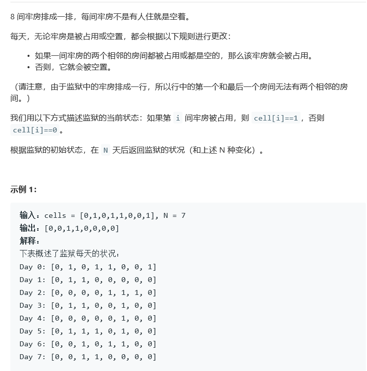
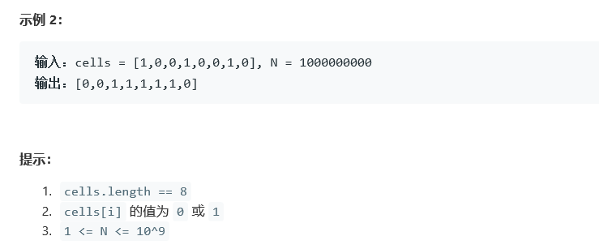

# 题目





# 算法

```python

```

```c++
class Solution {
public:
    vector<int> prisonAfterNDays(vector<int>& cells, int N) {
        //因为cells必定只有2^size种情况，所以，必定存在循环问题。
        if (N == 0) {
            return cells;
        }
        vector<vector<int>> res;
        int T = getCycle(cells, res);
        return res[N % T == 0 ? T : N % T ];
    }
private:
    int getCycle(vector<int>& v, vector<vector<int>>& res) {
        res.push_back(v);
        convert(v, v);
        vector<int> vx(v);
        int T = 0;
        do {
            res.push_back(v);
            convert(v, v);
            T++;
        } while (vx != v);
        return T;
    }
    void convert(vector<int> v1, vector<int>& v2) {
        //复制
        int n = v1.size();
        v2[0] = v2[n - 1] = 0;
        for (int i = 1; i < n - 1; i++) {
            v2[i] = v1[i - 1] == v1[i + 1];
        }
    }
};
```

