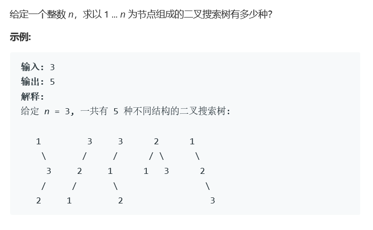
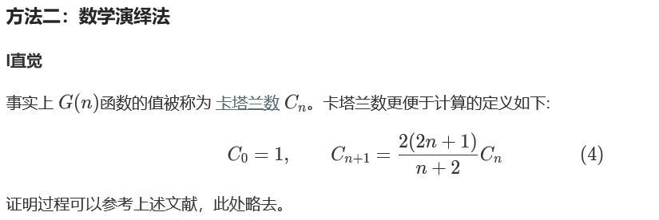

# 题目




# 算法

```python

```

```c++
class Solution {
public:
    //使用带有记录的递归来解决问题。
    //因为只要计算数字，那么1-2-3和1-2-4对于整个过程没有任何的区别，那么我们不再需要特殊计算，只需要计算位数，就可以。
    //整个过程可能可以使用公式法计算，但是我没有找到，只能继承95的方法基础上，进行简化计算。
    //空间会大一些。
    int *num,size;
    int generate(int n){
        if(num[n] != -1)
            return num[n];
        int tmp = 0;
        for(int i = 1; i <= n; i++){
            int left = generate(i-1);
            int right = generate(n-i);
            tmp += left*right;
        }
        num[n] = tmp;
        return tmp;
    }
    int numTrees(int n) {
        if(n < 3) return n;
        size = n;
        num = new int[n+1];
        num[0] = 1, num[1] = 1, num[2] = 2, num[3] = 5;
        for(int i = 4; i <= n; i++)
            num[i] = -1;
        return generate(n);
    }
};
```

以下为公式法：



```c++
class Solution {
  public: 
    int numTrees(int n) {
        long c = 1;
        for(int i = 0; i < n; i++){
            c = c*2 * (2*i+1)/(i+2);
        }
        return (int)c;
    }    
}

```

