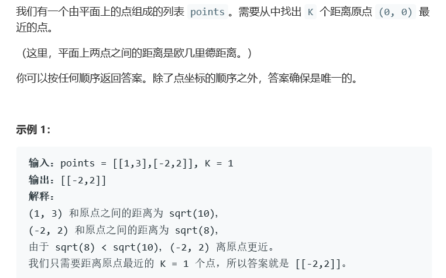
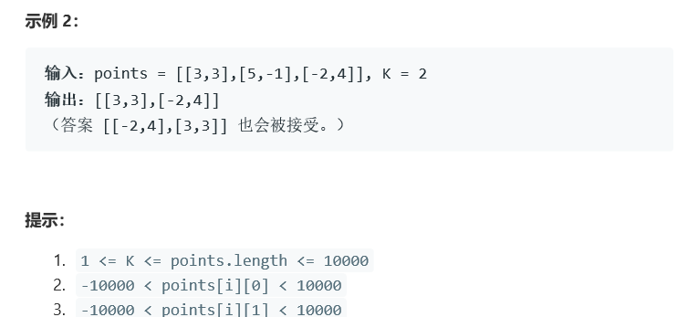

# 题目




# 算法

```python

```

```c++
class Solution {
public:
    struct Less
    {
        bool operator()(pair<int,int>& a, pair<int,int>& b)
        {
            return a.first<b.first;//升序排列
        }
    };
    vector<vector<int>> kClosest(vector<vector<int>>& points, int K) {
        vector<pair<int,int>> distance;
        int size = points.size();
        for(int i = 0; i < size; i++){
            int dis = 0;
            for(auto b : points[i]){
                dis += b*b;
            }
            distance.push_back(make_pair(dis,i));
        }
        sort(distance.begin(),distance.end(),Less());
        vector<vector<int>> res;
        for(int i = 0; i < K; i++){
            res.push_back(points[distance[i].second]);
        }
        return res;
    }
};
```

