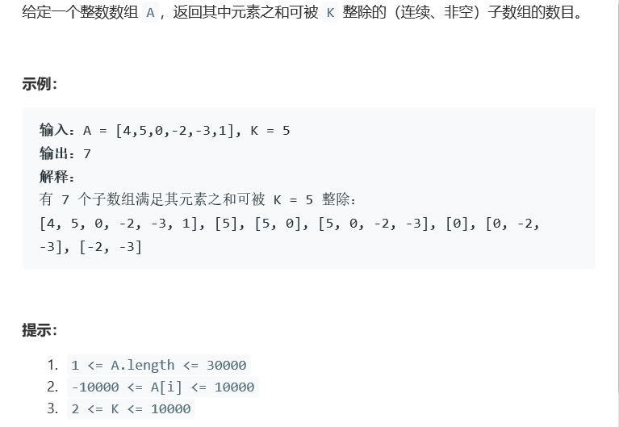

# 题目




# 算法

```python

```

```c++
class Solution {
public:
    int subarraysDivByK(vector<int>& A, int K) {
        //考虑可能出现K同号的情况，比如 [1,1,1,1,1] 5
        //简单方法所有集合数组看5 超出时间限制
        //前缀余数，隐性条件，连续集合？
         // 新new　一个余数大小的数组
        int* remainder = new int[K];
        for(int i = 1; i < K; i++)
            remainder[i] = 0;
        // 默认有一个解
        remainder[0] = 1;
        // 余数
        int mod = 0;
        // 求解个数
        int res = 0;
        for (int n: A) {
            mod = (mod + n) % K;
            // 如果余数为负数　我们将余数转为正余数
            if (mod < 0) mod += K;
            res += remainder[mod];
            remainder[mod]++;
        }
        return res;
    }
};
```

