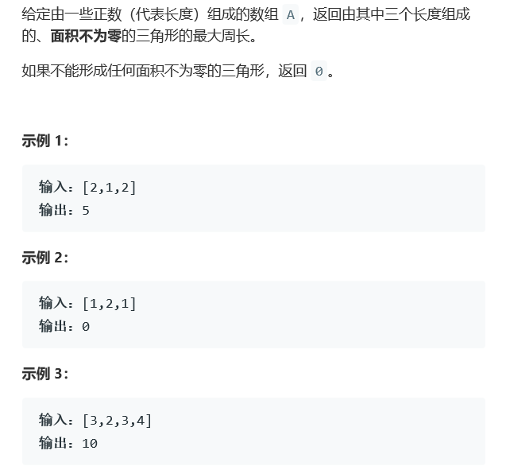
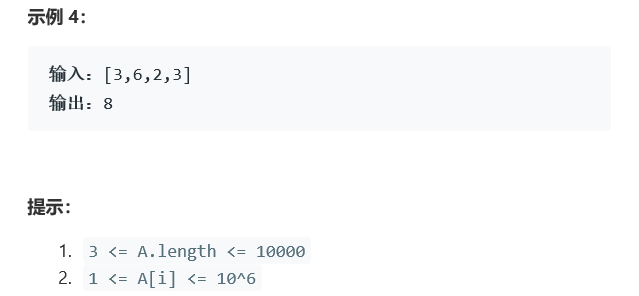

# 题目




# 算法

```python

```

```c++
class Solution {
public:
    int largestPerimeter(vector<int>& A) {
        if(A.size() < 3)
            return 0;
        sort(A.begin(),A.end());
        int i = A.size() -1, j = i - 2;
        while(j>=0){
            if(A[j] + A[j+1] > A[i])
                return A[j]+A[j+1]+A[i];
            else{
                j--;i--;
            }
        }
        return 0;
    }
};
```

