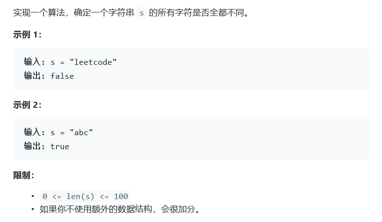

# 题目



# 算法

```python

```

```c++
class Solution {
public:
    //x左右寻找相同位置相同就是单独出现
    bool isUnique1(string astr) {
        for(int i=0; i<astr.size();i++){
            if(astr.find(astr[i])!=astr.rfind(astr[i])){
                return false;
            }
        }
        return true;
    }
    //似乎下面一种更棒，他100% 100%
    bool isUnique(string astr) {
        map<char,bool> dic;
        for(int i = 0; i < astr.size(); i++){
            if(dic.count(astr[i]))
                return false;
            else
                dic[astr[i]] = true;
        }
        return true;
    }
};
```

