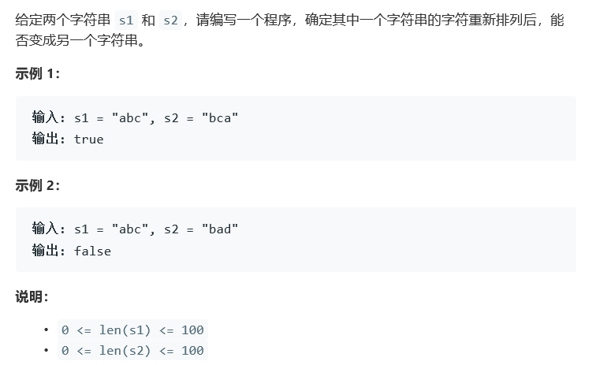

# 题目




# 算法

```python

```

```c++
class Solution {
public:
    bool CheckPermutation(string s1, string s2) {
        /*
            sort(s1.begin(),s1.end());
            sort(s2.begin(),s2.end());
            return s1 == s2;
        */
        /*
            //ascii
            //其实是有问题的，"ac" "bb"结果是相同的
            int sum1(0), sum2(0);
            if(s1.length() != s2.length()) return false;
            else{
                for(int i = 0; i < s1.length(); i++){
                    sum1 += s1[i];
                    sum2 += s2[i];
                }
                return sum1 == sum2;
            }
        */
        map<char, int> dic1,dic2;
        if(s1.length() != s2.length()) return false;
            else{
                for(int i = 0; i < s1.length(); i++){
                    dic1[s1[i]] ++;
                    dic2[s2[i]] ++;
                }
                return dic1 == dic2;
            }
    }
};
```

